# Dependency Injection Architecture

Dagger uses the `dependency-injector` library to implement a comprehensive dependency injection pattern. This promotes modularity, testability, and maintainability throughout the application.

## Package Layout

```
src/kp_dagger/
├── services/
│   ├── __init__.py
│   ├── core/
│   │   ├── __init__.py
│   │   ├── database/
│   │   │   ├── __init__.py          # from .service import DatabaseService
│   │   │   ├── interfaces.py        # IDatabaseService
│   │   │   ├── service.py           # DatabaseService
│   │   │   └── manager.py           # DatabaseManager (move from core/)
│   │   ├── encryption/
│   │   │   ├── __init__.py          # from .service import EncryptionService
│   │   │   ├── interfaces.py        # IEncryptionService
│   │   │   ├── service.py           # EncryptionService
│   │   │   └── crypto_engine.py     # Move from core/encryption.py
│   │   ├── rich_output/
│   │   │   ├── __init__.py          # from .service import RichOutputService
│   │   │   ├── interfaces.py        # IRichOutputService
│   │   │   ├── service.py           # RichOutputService
│   │   │   ├── formatters.py        # Rich formatting components
│   │   │   └── themes.py            # Color themes and styling
│   │   ├── file_handling/
│   │   │   ├── __init__.py          # from .service import FileHandlingService
│   │   │   ├── interfaces.py        # IFileHandlingService
│   │   │   ├── service.py           # FileHandlingService
│   │   │   ├── encoding_detector.py # Move from utils/get_file_encoding.py
│   │   │   └── hash_generator.py    # Move from utils/hash_generator.py
│   │   ├── parallel_processing/
│   │   │   ├── __init__.py          # from .service import ParallelProcessingService
│   │   │   ├── interfaces.py        # IParallelProcessingService
│   │   │   ├── service.py           # ParallelProcessingService
│   │   │   ├── worker_pool.py       # ProcessPoolExecutor management
│   │   │   └── task_coordinator.py  # Task distribution and aggregation
│   │   ├── logging/
│   │   │   ├── __init__.py          # from .service import LoggingService
│   │   │   ├── interfaces.py        # ILoggingService
│   │   │   ├── service.py           # LoggingService
│   │   │   ├── handlers.py          # Custom log handlers
│   │   │   └── formatters.py        # Log formatting (JSON, structured)
│   │   └── timestamp/
│   │       ├── __init__.py          # from .service import TimestampService
│   │       ├── interfaces.py        # ITimestampService
│   │       ├── service.py           # TimestampService
│   │       └── generator.py         # Move from utils/get_timestamp.py
│   │   ├── events/
│   │   │   ├── __init__.py          # from .service import EventBusService
│   │   │   ├── interfaces.py        # IEventBusService
│   │   │   ├── service.py           # EventBusService
│   │   │   └── models.py            # Event base classes and common events
│   │   ├── workflow/
│   │   │   ├── __init__.py          # from .service import WorkflowService
│   │   │   ├── interfaces.py        # IWorkflowService, IProgressReporter
│   │   │   ├── service.py           # WorkflowService
│   │   │   └── progress.py          # Progress reporting base classes
│   ├── parsing/
│   │   ├── __init__.py
│   │   ├── interfaces.py            # IParsingService
│   │   ├── service.py               # ParsingService (orchestrates parsers)
│   │   ├── factory.py               # ParserFactory (move from parsers/)
│   │   └── utils.py                 # Network validation utilities for parsing
│   ├── analysis/
│   │   ├── __init__.py
│   │   ├── interfaces.py            # IAnalysisService
│   │   ├── service.py               # AnalysisService (orchestrates analyzers)
│   │   ├── compliance/
│   │   │   ├── __init__.py
│   │   │   └── analyzer.py          # ComplianceAnalyzer
│   │   ├── vulnerability/
│   │   │   ├── __init__.py
│   │   │   └── analyzer.py          # VulnerabilityAnalyzer
│   │   └── risk/
│   │       ├── __init__.py
│   │       └── analyzer.py          # RiskAnalyzer
│   └── reporting/
│       ├── __init__.py
│       ├── interfaces.py            # IReportingService
│       ├── service.py               # ReportingService (orchestrates reporters)
│       ├── json/
│       │   ├── __init__.py
│       │   └── reporter.py          # JsonReporter
│       ├── html/
│       │   ├── __init__.py
│       │   └── reporter.py          # HtmlReporter
│       └── excel/
│           ├── __init__.py
│           └── reporter.py          # ExcelReporter
├── containers/
│   ├── __init__.py
│   ├── application.py               # ApplicationContainer
│   ├── core.py                      # CoreContainer
│   ├── parsers.py                   # ParserContainer
│   ├── analyzers.py                 # AnalyzerContainer
│   ├── reports.py                   # ReportContainer
│   ├── api_clients.py               # ApiClientContainer
│   └── config.py                    # Configuration models
├── cli/
├── models/
├── parsers/                         # Implementation classes only
│   ├── __init__.py
│   ├── base/
│   ├── cisco_ios/
│   ├── cisco_asa/
│   ├── fortigate/
│   └── paloalto/
├── analyzers/                       # Implementation classes only
│   ├── __init__.py
│   ├── queries/
│   ├── rules/
│   └── sql/
├── reports/                         # Implementation classes only
│   ├── __init__.py
│   ├── generator.py
│   ├── queries/
│   └── templates/
└── api_clients/
    ├── __init__.py
    ├── cve_details.py
    └── endoflife.py
```


## Architecture Overview

The dependency injection system is organized into service-specific containers that manage related dependencies:

```mermaid
flowchart TD
    A[ApplicationContainer] --> B[CoreContainer]
    A --> C[ParserContainer]
    A --> D[AnalyzerContainer]
    A --> E[ReportContainer]
    A --> F[ApiClientContainer]
    
    B --> B1[DatabaseService]
    B --> B2[EncryptionService]
    B --> B3[RichOutputService]
    B --> B4[FileHandlingService]
    B --> B5[ParallelProcessingService]
    B --> B6[LoggingService]
    B --> B7[TimestampService]
    B --> B8[EventBusService]
    B --> B9[WorkflowService]
    
    C --> C1[ParsingService]
    C --> C2[ParserFactory]
    
    D --> D1[AnalysisService]
    D --> D2[ComplianceAnalyzer]
    D --> D3[VulnerabilityAnalyzer]
    D --> D4[RiskAnalyzer]
    
    E --> E1[ReportingService]
    E --> E2[JsonReporter]
    E --> E3[HtmlReporter]
    E --> E4[ExcelReporter]
    
    F --> F1[CveClient]
    F --> F2[EolClient]
    
    style A fill:#e3f2fd
    style B fill:#fff3e0
    style C fill:#f3e5f5
    style D fill:#e8f5e8
    style E fill:#fce4ec
    style F fill:#f1f8e9
```



## Container Structure

### ApplicationContainer
The main container that orchestrates all service containers and provides the primary application services.

```python
from kp_kp_kp_dagger.containers import ApplicationContainer

# Initialize container
container = ApplicationContainer()

# Configure from dictionary
container.config.from_dict(config_data)

# Wire dependency injection
container.wire_modules()

# Access services
scanner = container.scanner()
```

### Service Containers

#### CoreContainer
Manages core infrastructure services:
- `DatabaseService` - SQLite database operations with encryption support
- `EncryptionService` - Data encryption/decryption
- `RichOutputService` - CLI presentation and formatting
- `FileHandlingService` - Unified file operations (encoding, hashing, reading)
- `ParallelProcessingService` - CPU-bound task coordination with ProcessPoolExecutor
- `LoggingService` - Process-safe structured logging
- `TimestampService` - Timestamp generation and formatting
- `EventBusService` - UI-agnostic event communication system
- `WorkflowService` - End-to-end process orchestration with progress reporting

#### ParserContainer
Manages configuration parsing services:
- `ParsingService` - Orchestrates parsing operations
- `ParserFactory` - Creates device-specific parsers

#### AnalyzerContainer
Manages security analysis services:
- `AnalysisService` - Orchestrates analysis operations
- `ComplianceAnalyzer` - CIS benchmark compliance
- `VulnerabilityAnalyzer` - CVE and security checks
- `RiskAnalyzer` - Risk assessment

#### ReportContainer
Manages report generation services:
- `ReportingService` - Orchestrates report generation
- `JsonReporter` - JSON format reports
- `HtmlReporter` - HTML format reports
- `ExcelReporter` - Excel format reports

#### ApiClientContainer
Manages external API clients:
- `CveClient` - CVE Details API client
- `EolClient` - End of Life API client

## Configuration

Configuration is managed through Pydantic models and can be loaded from YAML files:

```yaml
# config.yml
core:
  database:
    path: "./Dagger.sqlite"
  encryption:
    master_key: "production-key"
    salt: "production-salt"

api_clients:
  cve:
    api_key: "your-cve-api-key"
  eol: {}

scanner:
  verbose: false
  parallel_workers: 4
```

Load configuration:

```python
from kp_dagger.containers.config import load_config, validate_config

# Load and validate configuration
config_dict = load_config("config.yml")
config = validate_config(config_dict)

# Apply to container
container.config.from_dict(config_dict)
```

## Using Dependency Injection

### In Service Classes

Services can use dependency injection through constructor injection:

```python
from dependency_injector.wiring import Provide, inject
from kp_dagger.containers import ApplicationContainer

class MyService:
    @inject
    def __init__(
        self,
        database: DatabaseManager = Provide[ApplicationContainer.core_container.database_manager],
        parser_factory: ParserFactory = Provide[ApplicationContainer.parser_container.parser_factory],
    ):
        self.database = database
        self.parser_factory = parser_factory
```

### In CLI Commands

CLI commands can access the container through the Click context:

```python
@click.command()
@click.pass_context
def my_command(ctx: click.Context):
    container = ctx.obj["container"]
    scanner = container.scanner()
    # Use scanner...
```

### In Tests

Tests can create and configure containers for isolated testing:

```python
def test_my_service():
    container = ApplicationContainer()
    container.config.from_dict({
        "core": {
            "database": {"path": ":memory:"},
            "encryption": {"master_key": "test", "salt": "test"},
        },
        # ... other config
    })
    
    service = container.my_service()
    # Test service...
```

## Benefits

### Modularity
- Services are loosely coupled
- Easy to swap implementations
- Clear separation of concerns

### Testability
- Services can be easily mocked
- Isolated unit testing
- Configurable test environments

### Maintainability
- Centralized dependency management
- Configuration-driven behavior
- Clear dependency relationships

### Extensibility
- New services easily added
- Plugin-like architecture
- Multiple environment support

## Best Practices

### Service Design
1. Keep services focused on single responsibilities
2. Use constructor injection for dependencies
3. Avoid circular dependencies
4. Make services stateless when possible

### Configuration
1. Use environment-specific config files
2. Validate configuration on startup
3. Provide sensible defaults
4. Document all configuration options

### Testing
1. Create container fixtures for tests
2. Use in-memory databases for unit tests
3. Mock external dependencies
4. Test configuration validation

### Error Handling
1. Validate dependencies on container creation
2. Provide clear error messages for missing config
3. Fail fast on invalid configurations
4. Log dependency resolution issues

## Migration Guide

### From Direct Instantiation

**Before:**
```python
class SomeService:
    def __init__(self):
        self.database = DatabaseManager("/path/to/db")
        self.parser = ParserFactory()
```

**After:**
```python
class SomeService:
    @inject
    def __init__(
        self,
        database: DatabaseManager = Provide[ApplicationContainer.core_container.database_manager],
        parser: ParserFactory = Provide[ApplicationContainer.parser_container.parser_factory],
    ):
        self.database = database
        self.parser = parser
```

### Wiring Modules

Add modules to the container's wire configuration:

```python
def wire_modules(self) -> None:
    self.wire(
        modules=[
            "your.module.path",
        ],
    )
```

## Troubleshooting

### Common Issues

1. **ImportError for dependency-injector**: Ensure package is installed
2. **Circular imports**: Review module import order
3. **Missing configuration**: Check required config fields
4. **Wiring failures**: Verify module paths in wire_modules

### Debug Tips

1. Enable verbose logging to see dependency resolution
2. Use container introspection methods
3. Check configuration validation errors
4. Verify service factory configurations
