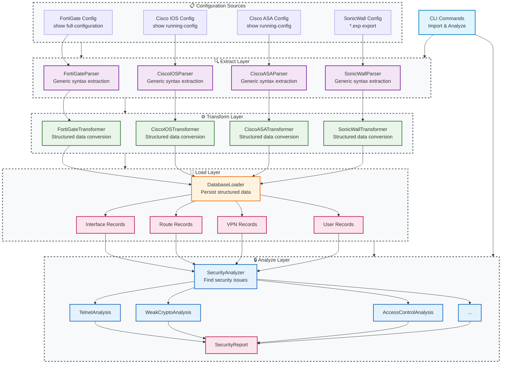

# KP Dagger - ETL Processing Architecture

## Overview

KP Dagger implements a five-layer ETL (Extract, Transform, Load, Analyze, Report) architecture for processing network device configurations. This architecture separates the concerns of syntax parsing, data transformation, persistence, security analysis, and reporting into distinct, loosely coupled layers.

The ETL processing architecture enables systematic analysis of security configurations across multiple network device vendors (FortiGate, Cisco IOS, Cisco ASA, SonicWall) by standardizing the flow from raw configuration text to actionable security findings.

## Architectural Principles

### Design Goals
- **Separation of Concerns**: Each layer has a single, well-defined responsibility in the processing pipeline
- **Vendor Extensibility**: New device types can be added without modifying existing parsers or analyzers
- **Data Persistence**: Structured configuration data is stored in the database for on-demand analysis and reporting
- **Analysis Flexibility**: Security analysis can be performed independently of configuration import
- **Processing Efficiency**: Bulk configuration imports are separated from potentially expensive analysis operations

### Key Benefits
- **Scalable Multi-Vendor Support**: Adding new device types requires only vendor-specific parser and transformer implementations
- **Independent Processing Stages**: Import, transformation, storage, and analysis can be performed at different times and speeds
- **Reusable Analysis**: Security analysis can be re-run on stored data without re-parsing configurations
- **Database-Driven Architecture**: All configuration data is persisted for reporting, trending, and historical analysis
- **Clear Testing Boundaries**: Each layer can be tested independently with well-defined interfaces

## Architecture Overview

The ETL architecture processes network configurations through four distinct layers, with the database serving as the boundary between data processing and security analysis.



## Extract Layer Protocols

The Extract layer implements vendor-specific parsers that convert raw configuration text into generic structured data using simple parameter extraction patterns.  It preserves original syntax and line content and organizes content into vendor-defined sections, if such structure exists in the source configuration.

### DeviceParser Protocol

::: kp_dagger.parsers.base.protocols

### Shared Configuration Types

The device configuration type system is defined in `kp_dagger.models.types` for reuse across the entire application:

::: kp_dagger.models.base.types.device_config

**TypeGuard Use Case**: Our `ConfigValue` union type can be many different things (str, int, dict, list, etc.). When navigating configuration hierarchies, we need to safely narrow the type at each step. TypeGuard functions tell the type checker "if this function returns True, you can trust that the value is the specific type."

**Real-World Example**: FortiGate config navigation:
```python
def extract_fortigate_policies(content: ConfigContent) -> list[dict]:
    """Extract firewall policies with full type safety."""
    firewall = content.get("firewall")
    if not is_config_section(firewall):
        return []
    
    # Type checker now knows firewall is ConfigSection 
    policies = firewall.get("policy")
    if not is_config_list(policies):
        return []
    
    # Type checker now knows policies is list[ConfigSection]
    return policies  # ✅ No type errors!
```

Without TypeGuard, you'd need verbose casting or type: ignore comments everywhere.

This shared module enables consistent type checking across:
- **Parser implementations** (FortiGate, Cisco, SonicWall parsers)
- **Transformer layer** (vendor-specific data extraction)
- **Testing utilities** (test fixtures and mocks)
- **Serialization logic** (JSON/database persistence)
- **API endpoints** (if configuration data is exposed via REST)

## Transform Layer Protocols

The Transform layer converts generic parsed configuration into structured business objects and extracts device identification information that requires vendor-specific interpretation.

### DeviceTransformer Protocol

```python
from typing import Protocol
from kp_dagger.models.base import KPDaggerBaseModel

class DeviceInfo(KPDaggerBaseModel):
    """Device identification and metadata extracted from configuration."""
    vendor: str
    model: str | None = None
    firmware_version: str | None = None
    hostname: str | None = None
    serial_number: str | None = None
    # Note: discovery timing tracked via inherited created_at field

class Interface(KPDaggerBaseModel):
    """Network interface configuration."""
    name: str
    ip_address: str | None = None
    subnet_mask: str | None = None
    status: str  # "up", "down"
    allowed_access: list[str] = []
    interface_type: str  # "physical", "vlan", "tunnel"
    vdom: str = "root"

class Route(KPDaggerBaseModel):
    """Routing table entry."""
    destination: str
    gateway: str
    interface: str
    metric: int
    route_type: str  # "static", "ospf", "connected"

class IPSecTunnel(KPDaggerBaseModel):
    """IPSec VPN tunnel configuration."""
    name: str
    remote_gateway: str
    local_interface: str
    encryption: str
    authentication: str
    pfs_group: str | None = None
    status: str

class UserAccount(KPDaggerBaseModel):
    """User account configuration."""
    username: str
    password_hash: str | None = None
    privileges: list[str] = []
    authentication_method: str
    last_login: str | None = None

class DeviceTransformer(Protocol):
    """Protocol for transforming parsed config to structured data."""
    
    def get_device_info(self) -> DeviceInfo:
        """Extract device identification requiring vendor-specific interpretation."""
        
    def get_interfaces(self) -> list[Interface]:
        """Extract structured interface data from parsed config."""
        
    def get_routing_table(self) -> list[Route]:
        """Extract routing configuration."""
        
    def get_ipsec_tunnels(self) -> list[IPSecTunnel]:
        """Extract IPSec VPN configurations."""
        
    def get_user_accounts(self) -> list[UserAccount]:
        """Extract user account configurations."""
```

## Load Layer Implementation

The Load layer persists structured configuration data to the database using SQLModel-based data models.

### DatabaseLoader

```python
from sqlmodel import Session
from uuid import uuid4
from datetime import datetime

class DatabaseLoader:
    """Loads structured configuration data into the database."""
    
    def __init__(self, db_session: Session):
        self._session = db_session
        
    def load_device_config(
        self,
        device_info: DeviceInfo,
        interfaces: list[Interface],
        routes: list[Route],
        ipsec_tunnels: list[IPSecTunnel],
        users: list[UserAccount],
    ) -> str:
        """Persist complete device configuration to database."""
        
        # Create device record
        device_id = str(uuid4())
        device_record = DeviceRecord(
            id=device_id,
            vendor=device_info.vendor,
            model=device_info.model,
            hostname=device_info.hostname,
            # Note: import timing tracked via inherited created_at field
        )
        self._session.add(device_record)
        
        # Load interfaces
        for interface in interfaces:
            interface_record = InterfaceRecord(
                device_id=device_id,
                name=interface.name,
                ip_address=interface.ip_address,
                status=interface.status,
                # ... other fields
            )
            self._session.add(interface_record)
        
        # Load routes, VPN configs, users...
        self._session.commit()
        return device_id
```

## Analyze Layer Implementation

The Analyze layer queries persisted configuration data and performs security analysis to identify vulnerabilities and policy violations.

### SecurityAnalyzer

```python
class SecurityAnalyzer:
    """Analyzes device configurations for security issues."""
    
    def __init__(self, db_session: Session):
        self._session = db_session
        
    def analyze_device(self, device_id: str) -> SecurityReport:
        """Perform comprehensive security analysis on device."""
        
        findings = []
        
        # Load device data from database
        device = self._get_device(device_id)
        interfaces = self._get_interfaces(device_id)
        routes = self._get_routes(device_id)
        vpn_configs = self._get_vpn_configs(device_id)
        
        # Perform vendor-specific security analysis
        analyzer = self._get_vendor_analyzer(device.vendor)
        findings.extend(analyzer.analyze_telnet_exposure(interfaces))
        findings.extend(analyzer.analyze_weak_crypto(vpn_configs))
        findings.extend(analyzer.analyze_access_control(interfaces, routes))
        
        return SecurityReport(
            device_id=device_id,
            findings=findings,
            risk_summary=self._calculate_risk_summary(findings),
            # Note: analysis timing tracked via inherited created_at field
        )
        
    def _get_vendor_analyzer(self, vendor: str) -> VendorSecurityAnalyzer:
        """Get vendor-specific security analyzer."""
        analyzers = {
            "fortigate": FortiGateSecurityAnalyzer(),
            "cisco_ios": CiscoIOSSecurityAnalyzer(),
            "cisco_asa": CiscoASASecurityAnalyzer(),
            "sonicwall": SonicWallSecurityAnalyzer(),
        }
        return analyzers[vendor.lower()]
```

## CLI Integration

The ETL architecture is exposed through CLI commands that separate import and analysis operations.

### Import Commands

```python
import click
from dependency_injector.wiring import inject, Provide
from kp_dagger.containers import ApplicationContainer

@click.group()
def import_config():
    """Import device configurations into KP Dagger."""
    pass

@click.command()
@click.argument("config_file", type=click.Path(exists=True))
@click.option("--device-type", required=True, 
              type=click.Choice(["fortigate", "cisco_ios", "cisco_asa", "sonicwall"]))
@inject
def device(
    config_file: str,
    device_type: str,
    parser_factory=Provide[ApplicationContainer.parsers.parser_factory],
    transformer_factory=Provide[ApplicationContainer.parsers.transformer_factory],
    database_loader=Provide[ApplicationContainer.core.database_loader],
    output=Provide[ApplicationContainer.core.rich_output],
):
    """Import a device configuration file."""
    try:
        # Extract - generic syntax parsing only
        parser = parser_factory.create_parser(device_type)
        with open(config_file, 'r') as f:
            config_text = f.read()
        parsed_config = parser.parse_config(config_text)
        
        # Transform - structured data extraction and device identification
        transformer = transformer_factory.create_transformer(device_type, parsed_config)
        device_info = transformer.get_device_info()  # Moved to transformer layer
        interfaces = transformer.get_interfaces()
        routes = transformer.get_routing_table()
        ipsec_tunnels = transformer.get_ipsec_tunnels()
        users = transformer.get_user_accounts()
        
        # Load
        device_id = database_loader.load_device_config(
            device_info, interfaces, routes, ipsec_tunnels, users
        )
        
        output.success(f"Imported {device_type} configuration: {device_id}")
        output.info(f"Found {len(interfaces)} interfaces, {len(routes)} routes")
        
    except Exception as e:
        output.error(f"Import failed: {e}")
        raise click.ClickException(str(e))

import_config.add_command(device)
```

### Analysis Commands

```python
@click.group()
def analyze():
    """Analyze device configurations for security issues."""
    pass

@click.command()
@click.argument("device_id")
@click.option("--format", default="console", type=click.Choice(["console", "json", "pdf"]))
@inject
def device(
    device_id: str,
    format: str,
    security_analyzer=Provide[ApplicationContainer.analyzers.security_analyzer],
    report_generator=Provide[ApplicationContainer.reports.report_generator],
    output=Provide[ApplicationContainer.core.rich_output],
):
    """Analyze a device configuration for security issues."""
    try:
        # Analyze
        security_report = security_analyzer.analyze_device(device_id)
        
        # Generate report
        if format == "console":
            report_generator.display_console_report(security_report)
        elif format == "json":
            report_generator.export_json_report(security_report)
        elif format == "pdf":
            report_generator.export_pdf_report(security_report)
            
        output.success(f"Analysis complete: {len(security_report.findings)} findings")
        
    except Exception as e:
        output.error(f"Analysis failed: {e}")
        raise click.ClickException(str(e))

analyze.add_command(device)
```

## Vendor-Specific Implementation Examples

### FortiGate Implementation

```python
class FortiGateParser:
    """FortiGate configuration parser - focused on generic syntax extraction."""
    
    def parse_config(self, config_text: str) -> ParsedDeviceConfig:
        """Parse FortiGate configuration using regex patterns for parameter=value extraction."""
        # Implementation using simple_python_parser.py logic
        # Extracts all "set parameter value" patterns generically
        # Returns sections like: {"system global": {"admin-telnet": "enable", ...}}
        pass

class FortiGateTransformer:
    """Transforms FortiGate parsed config to structured data and extracts device info."""
    
    def __init__(self, config: ParsedDeviceConfig):
        self.config = config
        
    def get_device_info(self) -> DeviceInfo:
        """Extract FortiGate device identification from parsed config."""
        # FortiGate uses sections, access via content
        system_config = self.config.content.get("system", {})
        global_config = system_config.get("global", {}) if isinstance(system_config, dict) else {}
        
        return DeviceInfo(
            vendor="fortigate",
            model=self._extract_model_from_config(),  # Vendor-specific logic
            firmware_version=self._extract_firmware_version(),  # From config header
            hostname=global_config.get("hostname"),
            serial_number=self._extract_serial_number(),
        )
        
    def get_interfaces(self) -> list[Interface]:
        """Extract FortiGate interface configurations."""
        interfaces = []
        # FortiGate: content["system"]["interface"] = {"wan1": {...}, "lan1": {...}}
        system_config = self.config.content.get("system", {})
        raw_interfaces = system_config.get("interface", {}) if isinstance(system_config, dict) else {}
        
        for name, raw_config in raw_interfaces.items():
            interface = Interface(
                name=name,
                ip_address=self._parse_ip(raw_config.get("ip", "")),
                status=raw_config.get("status", "unknown"),
                allowed_access=raw_config.get("allowaccess", "").split(),
                interface_type=raw_config.get("type", "unknown"),
                vdom=raw_config.get("vdom", "root"),
            )
            interfaces.append(interface)
            
        return interfaces
        
    def _extract_model_from_config(self) -> str | None:
        """Extract FortiGate model from config header comments."""
        # Vendor-specific logic to parse model from config header
        # Example: "#config-version=FGT60F-7.6.3" -> "FortiGate-60F"
        pass
```

## Vendor-Specific Content Structure Examples

The structured type system allows each vendor's parser to organize data naturally while maintaining type safety:

```python
from kp_dagger.models.base.types import ConfigContent

# FortiGate - Hierarchical sections (ConfigContent with nested ConfigSection)
fortigate_content: ConfigContent = {
    "system": {
        "global": {"hostname": "FW01", "admin-telnet": "enable"},  # ConfigSection
        "interface": {  # ConfigSection containing interface configs
            "wan1": {"ip": "192.168.1.1/24", "allowaccess": ["ping", "ssh"]},
            "lan1": {"ip": "10.0.1.1/24", "allowaccess": ["ping", "https"]}
        }
    },
    "firewall": {
        "policy": [  # list[ConfigSection] for multiple policies
            {"id": 1, "srcintf": "lan1", "dstintf": "wan1", "action": "accept"},
            {"id": 2, "srcintf": "wan1", "dstintf": "lan1", "action": "deny"}
        ]
    }
}

# Cisco IOS - Interface-centric with lists (ConfigContent with list structures)
cisco_ios_content: ConfigContent = {
    "interfaces": [  # list[ConfigSection] for multiple interfaces
        {
            "name": "GigabitEthernet0/1",
            "ip_address": "192.168.1.1 255.255.255.0", 
            "status": "no shutdown",
            "config_lines": ["ip address 192.168.1.1 255.255.255.0", "no shutdown"]
        },
        {
            "name": "GigabitEthernet0/2",
            "status": "shutdown",
            "config_lines": ["shutdown"]
        }
    ],
    "global_config": {  # ConfigSection
        "hostname": "Router01",
        "enable_secret": "encrypted_password"
    },
    "routing": {  # ConfigSection
        "static_routes": ["ip route 0.0.0.0 0.0.0.0 192.168.1.254"]  # list[str]
    }
}

# SonicWall - Rule-based flat structure (ConfigContent with rule arrays)
sonicwall_content: ConfigContent = {
    "access_rules": [  # list[ConfigSection] for access rules
        {
            "from": "LAN Subnets", "to": "WAN Interface", 
            "service": "any", "action": "permit"
        },
        {
            "from": "DMZ Subnets", "to": "WAN Interface",
            "service": "any", "action": "deny"  
        }
    ],
    "nat_policies": [  # list[ConfigSection] for NAT policies
        {"original": "192.168.1.0/24", "translated": "203.0.113.10", "interface": "X1"}
    ],
    "zones": ["LAN", "WAN", "DMZ"],  # list[str]
    "system_config": {"hostname": "SonicWall01", "firmware": "7.0.1"}  # ConfigSection
}
```

## Type Safety Benefits

The structured type system provides several advantages:

```python
from kp_dagger.models.base.types import ConfigContent, ConfigValue, ConfigSection, is_config_section

# Type checking catches errors at development time
def process_fortigate_interfaces(content: ConfigContent) -> list[str]:
    """Extract interface names with type safety."""
    system = content.get("system")
    if not isinstance(system, dict):
        return []
    
    interfaces = system.get("interface") 
    if not isinstance(interfaces, dict):
        return []
    
    # Type checker knows interfaces is dict[str, ConfigValue]
    return list(interfaces.keys())  # ✅ Type safe

# Vendor-specific type guards for safer access - now imported from shared module
# from kp_dagger.models.types import is_config_section, is_config_list
```

This approach gives each vendor's parser complete freedom to structure data optimally while the transformer layer handles vendor-specific navigation patterns with full type safety.

class FortiGateSecurityAnalyzer:
    """FortiGate-specific security analysis."""
    
    def analyze_telnet_exposure(self, interfaces: list[Interface]) -> list[SecurityFinding]:
        """Analyze FortiGate telnet configuration."""
        findings = []
        
        # FortiGate requires both global setting AND interface allowaccess
        for interface in interfaces:
            if "telnet" in interface.allowed_access:
                findings.append(SecurityFinding(
                    risk_level="HIGH",
                    category="remote_access",
                    target=f"Interface {interface.name}",
                    description=f"Telnet enabled on {interface.name} ({interface.ip_address})",
                    recommendation="Remove telnet from allowaccess, use SSH instead",
                ))
                
        return findings
```

## Usage Examples

### Complete ETL Workflow

```bash
# Import FortiGate configuration
kp-dagger import device fortigate-config.txt --device-type fortigate
# Output: Imported fortigate configuration: abc123-def456-789

# Import Cisco configuration  
kp-dagger import device cisco-config.txt --device-type cisco_ios
# Output: Imported cisco_ios configuration: xyz789-abc123-456

# Analyze specific device
kp-dagger analyze device abc123-def456-789
# Output: Analysis complete: 12 findings (3 HIGH, 5 MEDIUM, 4 LOW)

# Generate PDF report
kp-dagger analyze device abc123-def456-789 --format pdf
# Output: Report saved to: security-report-abc123-def456-789.pdf

# Analyze all devices
kp-dagger analyze all-devices
# Output: Analyzed 15 devices, 47 total findings
```

### Bulk Import Operations

```bash
# Import multiple configurations
kp-dagger import batch configs/ --device-type fortigate
# Output: Imported 25 configurations, 3 failed

# Re-analyze all devices after rule updates
kp-dagger analyze refresh --all
# Output: Re-analyzed 25 devices with updated security rules
```

## Performance Considerations

### Import Performance

- **Parallel Processing**: Multiple configurations can be imported concurrently since each creates independent database transactions
- **Bulk Database Operations**: Use SQLModel bulk insert operations for large configuration sets
- **Memory Management**: Stream large configuration files rather than loading entirely into memory

### Analysis Performance

- **Database Indexing**: Index device_id, vendor, and timestamp fields for fast query performance
- **Analysis Caching**: Cache analysis results with configuration checksums to avoid re-analysis of unchanged configs
- **Incremental Analysis**: Support delta analysis for configuration changes rather than full re-analysis

### Storage Optimization

- **Configuration Compression**: Store raw configuration text with compression to reduce database size
- **Archival Strategy**: Move old device configurations to archival storage after configurable retention period
- **Query Optimization**: Use database views and materialized queries for common reporting operations

## Testing Patterns

### Layer-Specific Testing

```python
def test_fortigate_parser():
    """Test FortiGate parser extract layer."""
    parser = FortiGateParser()
    config_text = load_test_config("fortigate-sample.txt")
    
    parsed_config = parser.parse_config(config_text)
    assert "system interface" in parsed_config.sections
    assert len(parsed_config.sections["system interface"]) == 25

def test_fortigate_transformer():
    """Test FortiGate transformer layer."""
    parsed_config = load_parsed_config("fortigate-parsed.json")
    transformer = FortiGateTransformer(parsed_config)
    
    # Test device info extraction (moved from parser)
    device_info = transformer.get_device_info()
    assert device_info.vendor == "fortigate"
    assert device_info.model == "FortiGate-60F"
    
    # Test interface extraction
    interfaces = transformer.get_interfaces()
    assert len(interfaces) == 25
    assert interfaces[0].name == "wan1"
    assert interfaces[0].status == "up"

def test_security_analyzer():
    """Test security analysis layer."""
    interfaces = load_test_interfaces()
    analyzer = FortiGateSecurityAnalyzer()
    
    findings = analyzer.analyze_telnet_exposure(interfaces)
    assert len(findings) == 3  # Expected telnet findings
    assert all(f.risk_level == "HIGH" for f in findings)
```

### Integration Testing

```python
def test_complete_etl_flow():
    """Test complete ETL processing flow."""
    with tempfile.TemporaryDirectory() as temp_dir:
        # Setup test database
        test_db = create_test_database()
        
        # Extract
        parser = FortiGateParser()
        config_text = load_test_config("fortigate-full.txt")
        parsed_config = parser.parse_config(config_text)
        
        # Transform
        transformer = FortiGateTransformer(parsed_config)
        interfaces = transformer.get_interfaces()
        
        # Load
        loader = DatabaseLoader(test_db.session)
        device_id = loader.load_device_config(interfaces, [], [], [])
        
        # Analyze
        analyzer = SecurityAnalyzer(test_db.session)
        report = analyzer.analyze_device(device_id)
        
        assert report.device_id == device_id
        assert len(report.findings) > 0
```

## Implementation Roadmap

### Phase 1: Foundation
- [ ] Implement DeviceParser and DeviceTransformer protocols
- [ ] Create FortiGate parser and transformer (extend existing simple_python_parser.py)
- [ ] Design and implement database schema for structured configuration data
- [ ] Build DatabaseLoader with SQLModel integration

### Phase 2: Security Analysis
- [ ] Implement SecurityAnalyzer base class and FortiGate-specific analyzer
- [ ] Create security finding data models and risk classification system
- [ ] Build vendor-specific security rule implementations
- [ ] Integrate security analysis with database queries

### Phase 3: CLI Integration
- [ ] Implement import commands with ETL processing
- [ ] Create analysis commands with report generation
- [ ] Add batch processing capabilities for multiple configurations
- [ ] Build progress indicators and error handling for long-running operations

### Phase 4: Multi-Vendor Support
- [ ] Implement Cisco IOS parser, transformer, and security analyzer
- [ ] Add Cisco ASA support with vendor-specific security rules
- [ ] Create SonicWall parser and analysis capabilities
- [ ] Build vendor detection and automatic parser selection

The ETL processing architecture provides a scalable, maintainable foundation for KP Dagger's network configuration security analysis capabilities. By separating extraction, transformation, loading, and analysis concerns, the system can efficiently process configurations from multiple vendors while providing flexible, on-demand security analysis capabilities.
