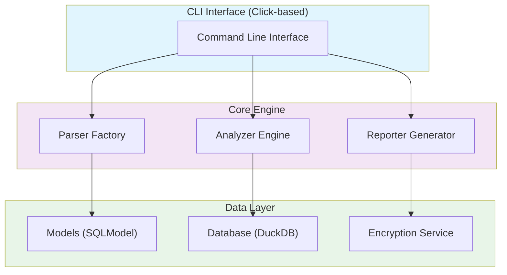
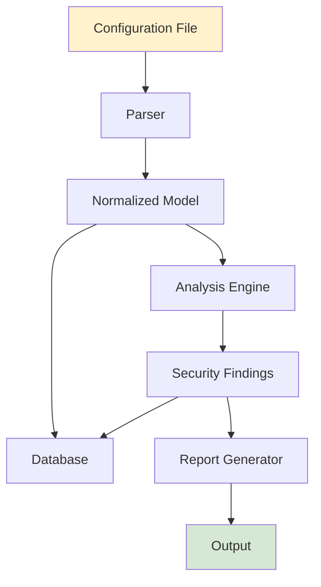
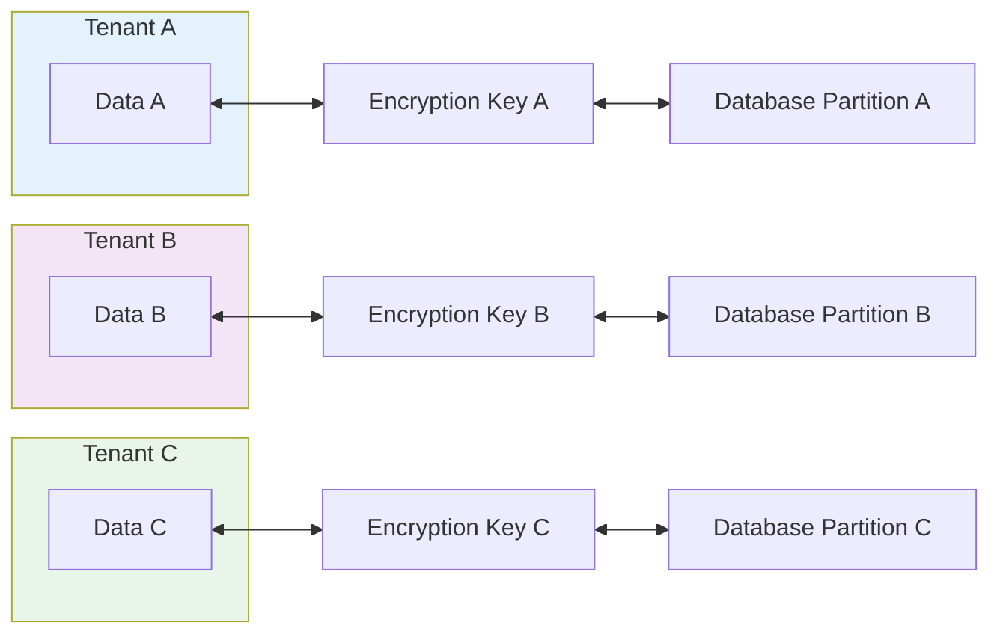

# Architecture Overview

Dagger is designed as a modular, extensible network device configuration analysis platform.

## High-Level Architecture

## Core Components

### 1. CLI Interface (`Dagger.cli`)

- **Click-based commands** for user interaction
- **Sub-commands** for different operations (analyze, report, validate)
- **Configuration management** through YAML files
- **Progress indication** and user feedback

### 2. Parser Factory (`Dagger.parsers`)

- **Device-specific parsers** for each supported platform
- **Extensible design** for adding new device types
- **Normalized output** format for consistent analysis
- **Error handling** for malformed configurations

### 3. Analysis Engine (`Dagger.analyzers`)

- **CIS Benchmark compliance** checking
- **Security rule analysis** for ACLs and firewall rules
- **Vulnerability detection** using CVE databases
- **End-of-life checks** for firmware versions

### 4. Data Models (`Dagger.models`)

- **SQLModel integration** for ORM and validation
- **Multi-tenant support** with tenant isolation
- **Field-level encryption** for sensitive data
- **Normalized schemas** across device types

### 5. Database Layer (`Dagger.core.database`)

- **DuckDB** for local, high-performance storage
- **Encrypted data** with Argon2id key derivation
- **ACID compliance** for data integrity
- **Schema migrations** for version upgrades

### 6. Reporting System (`Dagger.reports`)

- **Multiple output formats** (HTML, JSON, PDF, CSV)
- **Customizable templates** using Jinja2
- **Executive summaries** and technical details
- **Charts and visualizations** for findings

## Data Flow

### Analysis Pipeline

### Detailed Flow

1. **Input Processing**
   - Configuration file validation
   - Device type detection
   - Encoding normalization

2. **Parsing Phase**
   - Device-specific parsing logic
   - Syntax validation
   - Structure normalization

3. **Storage Phase**
   - Model validation (Pydantic)
   - Field encryption (sensitive data)
   - Database persistence (SQLModel/DuckDB)

4. **Analysis Phase**
   - CIS benchmark evaluation
   - Security rule analysis
   - Vulnerability correlation
   - Finding generation

5. **Reporting Phase**
   - Data aggregation
   - Template rendering
   - Output generation

## Design Principles

### 1. Modularity

Each component has a single responsibility:
- **Parsers** only handle configuration parsing
- **Analyzers** only perform security analysis
- **Models** only define data structures
- **Reports** only handle output generation

### 2. Extensibility

New components can be added without modifying existing code:
- **Parser registration** for new device types
- **Analyzer plugins** for custom checks
- **Report formatters** for new output types
- **Model extensions** for device-specific data

### 3. Security by Design

Security is built into every layer:
- **Encrypted storage** for all sensitive data
- **Tenant isolation** prevents data leakage
- **Input validation** prevents injection attacks
- **Secure defaults** for all configurations

### 4. Performance

Optimized for handling large configurations:
- **Streaming parsers** for large files
- **Batch processing** for multiple devices
- **Caching** for repeated operations
- **Database indexing** for fast queries

## Multi-Tenancy

### Tenant Isolation

### Benefits

- **Data separation** between customers
- **Independent configurations** per tenant
- **Scalable architecture** for service providers
- **Compliance support** for regulated industries

## Error Handling

### Layered Error Handling

1. **Input Validation**
   - File existence and readability
   - Supported device type
   - Valid configuration syntax

2. **Processing Errors**
   - Parser failures with context
   - Analysis engine exceptions
   - Database constraint violations

3. **Output Errors**
   - Template rendering issues
   - File system permissions
   - Network connectivity (for API calls)

### Error Recovery

- **Graceful degradation** when possible
- **Detailed error messages** for debugging
- **Logging** for audit trails
- **Retry mechanisms** for transient failures

## Integration Points

### External APIs

- **CVE Details API** for vulnerability data
- **End of Life API** for EOL information
- **Custom APIs** for organization-specific data

### Export Formats

- **SIEM integration** via JSON/CEF
- **Ticketing systems** via CSV/Excel
- **Compliance tools** via SCAP/OVAL
- **Custom formats** via plugin system

## Future Extensibility

### Planned Enhancements

- **Real-time analysis** for streaming configurations
- **Machine learning** for anomaly detection
- **API server** for programmatic access
- **Web interface** for interactive analysis
- **Cloud deployment** options
- **Distributed processing** for scale
