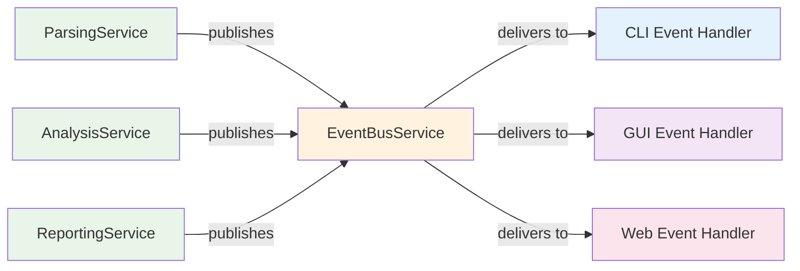

# UI-Service Communication Patterns

This document describes the hybrid event bus and progress callback architecture that enables complete decoupling between the service layer and user interface implementations.

## Overview

KP-Dagger uses a hybrid approach to maintain complete separation between business logic (services) and presentation logic (UI):

1. **Event Bus** - For architectural events and loose coupling
2. **Progress Callbacks** - For fine-grained progress reporting and real-time updates

This design ensures services remain UI-agnostic while providing rich feedback to CLI, GUI, or web interfaces.

## Event Bus Pattern

### Architecture

The `EventBusService` provides a pub-sub pattern where services publish events without knowing who (if anyone) is listening.



### Event Types

Events are strongly typed using Pydantic models for consistency with the project's data validation patterns:

```python
# models/events.py
from pydantic import BaseModel, Field, field_validator
from pathlib import Path
from datetime import datetime
from typing import Literal
import uuid

class BaseEvent(BaseModel):
    """Base class for all events with automatic timestamp and correlation tracking."""
    timestamp: datetime = Field(default_factory=datetime.now)
    correlation_id: str = Field(default_factory=lambda: str(uuid.uuid4()))
    
    class Config:
        # Allow Path objects and other complex types
        arbitrary_types_allowed = True
        # Use enum values for serialization
        use_enum_values = True

class FileProcessingStarted(BaseEvent):
    """Event published when file processing begins."""
    file_path: Path
    total_files: int = Field(gt=0, description="Total number of files to process")
    current_file: int = Field(gt=0, description="Current file number (1-indexed)")
    vendor_type: str = Field(min_length=1, description="Device vendor type")
    
    @field_validator('current_file')
    @classmethod
    def validate_current_file(cls, v, info):
        if 'total_files' in info.data and v > info.data['total_files']:
            raise ValueError('current_file cannot exceed total_files')
        return v

class FileProcessingCompleted(BaseEvent):
    """Event published when file processing completes."""
    file_path: Path
    duration: float = Field(ge=0, description="Processing duration in seconds")
    success: bool
    result_summary: dict = Field(default_factory=dict, description="Summary of processing results")

class ParsingError(BaseEvent):
    """Event published when parsing fails."""
    file_path: Path
    error_message: str = Field(min_length=1, description="Error description")
    vendor_type: str
    line_number: int | None = Field(default=None, ge=1, description="Line number where error occurred")

class AnalysisProgress(BaseEvent):
    """Event published during analysis operations."""
    analysis_type: str = Field(min_length=1, description="Type of analysis being performed")
    progress_percent: float = Field(ge=0, le=100, description="Progress percentage")
    message: str = Field(min_length=1, description="Progress message")
    findings_count: int = Field(ge=0, default=0, description="Number of findings discovered")

class VulnerabilityFound(BaseEvent):
    """Event published when a vulnerability is discovered."""
    severity: Literal["critical", "high", "medium", "low"] = Field(description="Vulnerability severity level")
    cve_id: str = Field(pattern=r'^CVE-\d{4}-\d+$', description="CVE identifier")
    description: str = Field(min_length=10, max_length=500, description="Vulnerability description")
    affected_component: str = Field(min_length=1, description="Component affected by vulnerability")

class ComplianceViolation(BaseEvent):
    """Event published when a compliance violation is found."""
    rule_id: str = Field(pattern=r'^[A-Z0-9\-_.]+$', description="CIS rule identifier")
    severity: Literal["critical", "high", "medium", "low", "info"] = Field(description="Violation severity")
    description: str = Field(min_length=10, max_length=500, description="Violation description")
    recommendation: str = Field(min_length=10, description="Remediation recommendation")
    line_number: int | None = Field(default=None, ge=1, description="Line number of violation")
```
```

### Service Implementation

Services publish events without any knowledge of UI implementations:

```python
# services/parsing/service.py
class ParsingService:
    @inject
    def __init__(
        self,
        event_bus: EventBusService = Provide[CoreContainer.event_bus_service],
        file_handler: FileHandlingService = Provide[CoreContainer.file_handling_service],
        logger: LoggingService = Provide[CoreContainer.logging_service],
    ):
        self.event_bus = event_bus
        self.file_handler = file_handler
        self.logger = logger

    def parse_file(self, file_path: Path, vendor_type: str) -> ParseResult:
        # Publish start event
        self.event_bus.publish(FileProcessingStarted(
            file_path=file_path,
            total_files=1,
            current_file=1,
            vendor_type=vendor_type
        ))
        
        try:
            # Perform parsing logic
            content = self.file_handler.read_file(file_path)
            
            # Validate syntax
            if not self._validate_syntax(content, vendor_type):
                raise ParseError(f"Invalid {vendor_type} configuration syntax")
            
            # Parse content
            result = self._parse_content(content, vendor_type)
            
            # Publish success event
            self.event_bus.publish(FileProcessingCompleted(
                file_path=file_path,
                duration=1.2,
                success=True,
                result_summary={"rules_count": len(result.rules)}
            ))
            
            return result
            
        except Exception as e:
            # Publish error event
            self.event_bus.publish(ParsingError(
                file_path=file_path,
                error_message=str(e),
                vendor_type=vendor_type
            ))
            
            # Log error (separate from event publishing)
            self.logger.error(f"Failed to parse {file_path}: {e}")
            raise

    def parse_multiple_files(self, file_paths: list[Path]) -> list[ParseResult]:
        results = []
        total_files = len(file_paths)
        
        for i, file_path in enumerate(file_paths, 1):
            vendor_type = self._detect_vendor_type(file_path)
            
            # Publish file start event with context
            self.event_bus.publish(FileProcessingStarted(
                file_path=file_path,
                total_files=total_files,
                current_file=i,
                vendor_type=vendor_type
            ))
            
            try:
                result = self._parse_single_file(file_path, vendor_type)
                results.append(result)
            except Exception as e:
                # Continue processing other files
                self.logger.warning(f"Skipping {file_path} due to error: {e}")
                continue
        
        return results
```

### UI Event Handlers

Each UI implementation creates its own event handlers:

#### CLI Event Handler

```python
# cli/events/handlers.py
class CliEventHandler:
    def __init__(self, rich_output: RichOutputService):
        self.rich_output = rich_output
        self.current_progress = None
        self.file_progress = None

    def handle_file_started(self, event: FileProcessingStarted) -> None:
        if event.total_files > 1:
            if not self.file_progress:
                self.file_progress = self.rich_output.create_progress_bar(
                    "Processing files...", 
                    total=event.total_files
                )
            self.file_progress.update(event.current_file)
        
        self.rich_output.info(
            f"[{event.vendor_type}] Processing {event.file_path.name}..."
        )

    def handle_file_completed(self, event: FileProcessingCompleted) -> None:
        if event.success:
            summary = event.result_summary
            self.rich_output.success(
                f"✓ {event.file_path.name} parsed successfully "
                f"({summary.get('rules_count', 0)} rules found, {event.duration:.1f}s)"
            )
        else:
            self.rich_output.warning(f"⚠ {event.file_path.name} completed with issues")

    def handle_parsing_error(self, event: ParsingError) -> None:
        location = f" at line {event.line_number}" if event.line_number else ""
        self.rich_output.error(
            f"✗ Failed to parse {event.file_path.name}{location}: {event.error_message}"
        )

    def handle_vulnerability_found(self, event: VulnerabilityFound) -> None:
        severity_color = {
            "critical": "red",
            "high": "orange",
            "medium": "yellow",
            "low": "blue"
        }.get(event.severity.lower(), "white")
        
        self.rich_output.warning(
            f"🔒 [{severity_color}]{event.severity.upper()}[/] "
            f"CVE-{event.cve_id}: {event.description}"
        )

    def handle_compliance_violation(self, event: ComplianceViolation) -> None:
        location = f" (line {event.line_number})" if event.line_number else ""
        self.rich_output.warning(
            f"📋 CIS {event.rule_id}: {event.description}{location}\n"
            f"   💡 {event.recommendation}"
        )
```

#### GUI Event Handler (Future)

```python
# gui/events/handlers.py
class GuiEventHandler:
    def __init__(self, main_window):
        self.main_window = main_window
        self.progress_dialog = None

    def handle_file_started(self, event: FileProcessingStarted) -> None:
        if not self.progress_dialog:
            self.progress_dialog = QProgressDialog(
                "Processing files...", 
                "Cancel", 
                0, 
                event.total_files,
                self.main_window
            )
        
        self.progress_dialog.setValue(event.current_file - 1)
        self.progress_dialog.setLabelText(f"Processing {event.file_path.name}")

    def handle_vulnerability_found(self, event: VulnerabilityFound) -> None:
        # Add to vulnerabilities table
        self.main_window.vulnerability_table.add_finding(
            event.cve_id,
            event.severity,
            event.description
        )
```

### Event Subscription

UIs subscribe to events they care about:

```python
# cli/commands/scan.py
@click.command()
@inject
def scan(
    config_paths: list[str],
    event_bus: EventBusService = Provide[CoreContainer.event_bus_service],
    workflow: WorkflowService = Provide[CoreContainer.workflow_service],
    rich_output: RichOutputService = Provide[CoreContainer.rich_output_service],
):
    # Create CLI event handler
    cli_handler = CliEventHandler(rich_output)
    
    # Subscribe to events of interest
    event_bus.subscribe(FileProcessingStarted, cli_handler.handle_file_started)
    event_bus.subscribe(FileProcessingCompleted, cli_handler.handle_file_completed)
    event_bus.subscribe(ParsingError, cli_handler.handle_parsing_error)
    event_bus.subscribe(VulnerabilityFound, cli_handler.handle_vulnerability_found)
    event_bus.subscribe(ComplianceViolation, cli_handler.handle_compliance_violation)
    
    # Execute workflow - services will publish events
    try:
        results = workflow.scan_configurations([Path(p) for p in config_paths])
        
        # Final summary (CLI-specific logic)
        total_files = len(config_paths)
        successful = sum(1 for r in results if r.success)
        rich_output.info(f"\nScan completed: {successful}/{total_files} files processed successfully")
        
    except KeyboardInterrupt:
        rich_output.warning("Scan cancelled by user")
    except Exception as e:
        rich_output.error(f"Scan failed: {e}")
        raise click.ClickException(str(e))
```

## Progress Callback Pattern

### Progress Reporter Interface

```python
# services/core/workflow/interfaces.py
from typing import Protocol

class IProgressReporter(Protocol):
    """UI-agnostic progress reporting interface."""
    
    def report_progress(self, step: str, percent: float, message: str) -> None:
        """Report progress for a single operation."""
        ...
    
    def report_file_progress(self, current: int, total: int, file_name: str) -> None:
        """Report progress across multiple files."""
        ...
    
    def report_substep(self, parent_step: str, substep: str, percent: float) -> None:
        """Report progress for sub-operations within a step."""
        ...
    
    def report_error(self, error: str, context: dict) -> None:
        """Report an error with context."""
        ...
    
    def report_completion(self, success: bool, duration: float, summary: dict) -> None:
        """Report operation completion."""
        ...
    
    def is_cancelled(self) -> bool:
        """Check if operation should be cancelled."""
        ...
```

### Service Implementation with Progress

```python
# services/analysis/service.py
class AnalysisService:
    def analyze_configuration(
        self,
        parsed_config: ParsedConfiguration,
        analysis_types: list[str],
        progress_reporter: IProgressReporter | None = None
    ) -> AnalysisResult:
        
        total_steps = len(analysis_types)
        results = {}
        
        for i, analysis_type in enumerate(analysis_types):
            if progress_reporter and progress_reporter.is_cancelled():
                raise OperationCancelledException("Analysis cancelled by user")
            
            step_percent = (i / total_steps) * 100
            
            if progress_reporter:
                progress_reporter.report_progress(
                    f"analysis_{analysis_type}",
                    step_percent,
                    f"Running {analysis_type} analysis..."
                )
            
            try:
                if analysis_type == "vulnerability":
                    result = self._analyze_vulnerabilities(parsed_config, progress_reporter)
                elif analysis_type == "compliance":
                    result = self._analyze_compliance(parsed_config, progress_reporter)
                elif analysis_type == "risk":
                    result = self._analyze_risk(parsed_config, progress_reporter)
                else:
                    raise ValueError(f"Unknown analysis type: {analysis_type}")
                
                results[analysis_type] = result
                
                # Publish findings via event bus
                if analysis_type == "vulnerability":
                    for vuln in result.vulnerabilities:
                        self.event_bus.publish(VulnerabilityFound(
                            severity=vuln.severity,
                            cve_id=vuln.cve_id,
                            description=vuln.description,
                            affected_component=vuln.component
                        ))
                
            except Exception as e:
                if progress_reporter:
                    progress_reporter.report_error(
                        f"Failed {analysis_type} analysis: {str(e)}",
                        {"analysis_type": analysis_type, "step": i}
                    )
                raise
        
        if progress_reporter:
            progress_reporter.report_completion(
                success=True,
                duration=2.5,
                summary={"analyses_completed": len(results)}
            )
        
        return AnalysisResult(results)

    def _analyze_vulnerabilities(
        self, 
        config: ParsedConfiguration,
        progress_reporter: IProgressReporter | None = None
    ) -> VulnerabilityAnalysisResult:
        
        components = config.get_components()
        total_components = len(components)
        
        vulnerabilities = []
        
        for i, component in enumerate(components):
            if progress_reporter:
                substep_percent = (i / total_components) * 100
                progress_reporter.report_substep(
                    "analysis_vulnerability",
                    f"checking_{component.name}",
                    substep_percent
                )
            
            # Check component for vulnerabilities
            component_vulns = self.vulnerability_analyzer.check_component(component)
            vulnerabilities.extend(component_vulns)
        
        return VulnerabilityAnalysisResult(vulnerabilities)
```

### UI Progress Implementations

#### CLI Progress Reporter

```python
# cli/progress/cli_progress_reporter.py
class CliProgressReporter(IProgressReporter):
    def __init__(self, rich_output: RichOutputService):
        self.rich_output = rich_output
        self.main_progress = None
        self.sub_progress = None
        self.cancelled = False

    def report_progress(self, step: str, percent: float, message: str) -> None:
        if not self.main_progress:
            self.main_progress = self.rich_output.create_progress_bar(
                "Analysis Progress", 
                total=100
            )
        
        self.main_progress.update(percent, message)

    def report_file_progress(self, current: int, total: int, file_name: str) -> None:
        if not self.file_progress:
            self.file_progress = self.rich_output.create_progress_bar(
                "File Progress",
                total=total
            )
        
        self.file_progress.update(current, f"Processing {file_name}")

    def report_substep(self, parent_step: str, substep: str, percent: float) -> None:
        if not self.sub_progress:
            self.sub_progress = self.rich_output.create_progress_bar(
                f"  ↳ {parent_step} details",
                total=100
            )
        
        self.sub_progress.update(percent, substep.replace("_", " ").title())

    def report_error(self, error: str, context: dict) -> None:
        step = context.get("analysis_type", "unknown")
        self.rich_output.error(f"Error in {step}: {error}")

    def report_completion(self, success: bool, duration: float, summary: dict) -> None:
        if self.main_progress:
            self.main_progress.update(100, "Complete")
        
        analyses = summary.get("analyses_completed", 0)
        self.rich_output.success(f"Analysis completed in {duration:.1f}s ({analyses} analyses)")

    def is_cancelled(self) -> bool:
        # In CLI, check for Ctrl+C or other cancellation signals
        return self.cancelled
```

#### GUI Progress Reporter

```python
# gui/progress/gui_progress_reporter.py
class GuiProgressReporter(IProgressReporter):
    def __init__(self, progress_dialog: QProgressDialog):
        self.progress_dialog = progress_dialog
        self.sub_dialog = None

    def report_progress(self, step: str, percent: float, message: str) -> None:
        self.progress_dialog.setValue(int(percent))
        self.progress_dialog.setLabelText(message)
        QApplication.processEvents()  # Keep UI responsive

    def report_substep(self, parent_step: str, substep: str, percent: float) -> None:
        if not self.sub_dialog:
            self.sub_dialog = QProgressDialog(
                f"Details for {parent_step}",
                "Cancel",
                0, 100,
                self.progress_dialog
            )
        
        self.sub_dialog.setValue(int(percent))
        self.sub_dialog.setLabelText(substep.replace("_", " ").title())

    def is_cancelled(self) -> bool:
        return self.progress_dialog.wasCanceled()
```

## Workflow Service Integration

The `WorkflowService` orchestrates the entire process using both patterns:

```python
# services/core/workflow/service.py
class WorkflowService:
    @inject
    def __init__(
        self,
        parsing_service: ParsingService = Provide[ParserContainer.parsing_service],
        analysis_service: AnalysisService = Provide[AnalyzerContainer.analysis_service],
        reporting_service: ReportingService = Provide[ReportContainer.reporting_service],
        event_bus: EventBusService = Provide[CoreContainer.event_bus_service],
    ):
        self.parsing = parsing_service
        self.analysis = analysis_service
        self.reporting = reporting_service
        self.event_bus = event_bus

    def scan_configurations(
        self,
        config_paths: list[Path],
        analysis_types: list[str] = None,
        report_formats: list[str] = None,
        progress_reporter: IProgressReporter | None = None
    ) -> list[ScanResult]:
        
        analysis_types = analysis_types or ["vulnerability", "compliance", "risk"]
        report_formats = report_formats or ["json"]
        
        results = []
        total_files = len(config_paths)
        
        for i, config_path in enumerate(config_paths, 1):
            if progress_reporter and progress_reporter.is_cancelled():
                break
            
            if progress_reporter:
                progress_reporter.report_file_progress(i, total_files, config_path.name)
            
            try:
                # Step 1: Parse (uses event bus internally)
                parsed_config = self.parsing.parse_file(config_path)
                
                # Step 2: Analyze (uses both event bus and progress callbacks)
                analysis_result = self.analysis.analyze_configuration(
                    parsed_config, 
                    analysis_types,
                    progress_reporter
                )
                
                # Step 3: Generate reports (uses progress callbacks)
                reports = self.reporting.generate_reports(
                    analysis_result,
                    report_formats,
                    progress_reporter
                )
                
                results.append(ScanResult(
                    config_path=config_path,
                    parsed_config=parsed_config,
                    analysis_result=analysis_result,
                    reports=reports,
                    success=True
                ))
                
            except Exception as e:
                # Error is published via event bus by individual services
                results.append(ScanResult(
                    config_path=config_path,
                    error=str(e),
                    success=False
                ))
        
        return results
```

## Usage Examples

### CLI Usage

```python
# cli/commands/scan.py
@click.command()
@click.option("--format", multiple=True, default=["json"], help="Report formats")
@click.option("--analysis", multiple=True, default=["vulnerability", "compliance"], help="Analysis types")
@inject
def scan(
    config_paths: list[str],
    format: tuple[str],
    analysis: tuple[str],
    event_bus: EventBusService = Provide[CoreContainer.event_bus_service],
    workflow: WorkflowService = Provide[CoreContainer.workflow_service],
    rich_output: RichOutputService = Provide[CoreContainer.rich_output_service],
):
    # Set up event handling
    cli_handler = CliEventHandler(rich_output)
    event_bus.subscribe(FileProcessingStarted, cli_handler.handle_file_started)
    event_bus.subscribe(ParsingError, cli_handler.handle_parsing_error)
    event_bus.subscribe(VulnerabilityFound, cli_handler.handle_vulnerability_found)
    
    # Set up progress reporting
    progress_reporter = CliProgressReporter(rich_output)
    
    # Execute scan
    results = workflow.scan_configurations(
        config_paths=[Path(p) for p in config_paths],
        analysis_types=list(analysis),
        report_formats=list(format),
        progress_reporter=progress_reporter
    )
    
    # CLI-specific summary
    successful = sum(1 for r in results if r.success)
    rich_output.info(f"Scan completed: {successful}/{len(results)} files processed")
```

### Testing

Both patterns are easily testable:

```python
# tests/test_workflow.py
class MockProgressReporter(IProgressReporter):
    def __init__(self):
        self.progress_calls = []
        self.error_calls = []
        self.cancelled = False
    
    def report_progress(self, step: str, percent: float, message: str) -> None:
        self.progress_calls.append((step, percent, message))
    
    def report_error(self, error: str, context: dict) -> None:
        self.error_calls.append((error, context))
    
    def is_cancelled(self) -> bool:
        return self.cancelled

class MockEventHandler:
    def __init__(self):
        self.events_received = []
    
    def handle_event(self, event):
        self.events_received.append(event)

def test_workflow_with_progress_and_events():
    # Setup
    container = create_test_container()
    workflow = container.workflow_service()
    event_bus = container.event_bus_service()
    
    # Mock handlers
    progress_reporter = MockProgressReporter()
    event_handler = MockEventHandler()
    
    event_bus.subscribe(FileProcessingStarted, event_handler.handle_event)
    event_bus.subscribe(VulnerabilityFound, event_handler.handle_event)
    
    # Execute
    results = workflow.scan_configurations(
        config_paths=[Path("test_config.txt")],
        progress_reporter=progress_reporter
    )
    
    # Verify progress callbacks
    assert len(progress_reporter.progress_calls) > 0
    assert progress_reporter.progress_calls[0][0] == "analysis_vulnerability"
    
    # Verify events
    assert len(event_handler.events_received) > 0
    assert isinstance(event_handler.events_received[0], FileProcessingStarted)
```

## Benefits

### Complete UI Decoupling
- Services have no UI dependencies
- Same services work with CLI, GUI, web, or API interfaces
- Easy to add new UI types without changing services

### Rich User Experience
- Real-time progress updates via callbacks
- Contextual notifications via events
- Cancellation support through progress interface

### Testability
- Mock event handlers for testing event publishing
- Mock progress reporters for testing progress reporting
- Services can be tested independently of any UI

### Flexibility
- UIs can choose which events to handle
- Different UIs can handle same events differently
- Progress reporting is optional and graceful when absent

### Maintainability
- Clear separation of concerns
- UI changes don't affect service logic
- Service changes only require UI updates if interfaces change
