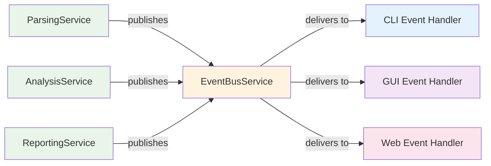

# UI-Service Communication Patterns

This document describes the hybrid event bus and progress callback architecture that enables complete decoupling between the service layer and user interface implementations.

## Overview

KP-Dagger uses a hybrid approach to maintain complete separation between business logic (services) and presentation logic (UI):

1. **Event Bus** - For architectural events and loose coupling
2. **Progress Callbacks** - For fine-grained progress reporting and real-time updates

This design ensures services remain UI-agnostic while providing rich feedback to CLI, GUI, or web interfaces.

## Event Bus Pattern

### Architecture

The `EventBusService` provides a pub-sub pattern where services publish events without knowing who (if anyone) is listening.



### Event Types

Events are strongly typed using Pydantic models for consistency with the project's data validation patterns:

```python
# models/events.py
from pydantic import BaseModel, Field, field_validator
from pathlib import Path
from datetime import datetime
from typing import Literal
import uuid

class BaseEvent(BaseModel):
    """Base class for all events with automatic timestamp and correlation tracking."""
    timestamp: datetime = Field(default_factory=datetime.now)
    correlation_id: str = Field(default_factory=lambda: str(uuid.uuid4()))
    
    class Config:
        # Allow Path objects and other complex types
        arbitrary_types_allowed = True
        # Use enum values for serialization
        use_enum_values = True

# Generic event types that balance flexibility with type safety

class OperationStarted(BaseEvent):
    """Generic event for any operation beginning."""
    operation_type: str = Field(min_length=1, description="Type of operation (parsing, analysis, reporting)")
    resource_path: Path | None = Field(default=None, description="Path to resource being processed")
    context: dict = Field(default_factory=dict, description="Operation-specific context")
    batch_info: dict | None = Field(default=None, description="Batch processing information (current, total)")

class OperationCompleted(BaseEvent):
    """Generic event for any operation completion."""
    operation_type: str = Field(min_length=1, description="Type of operation that completed")
    resource_path: Path | None = Field(default=None, description="Path to resource that was processed")
    success: bool
    duration: float = Field(ge=0, description="Operation duration in seconds")
    results: dict = Field(default_factory=dict, description="Operation results and summary data")

class OperationError(BaseEvent):
    """Generic event for operation failures."""
    operation_type: str = Field(min_length=1, description="Type of operation that failed")
    resource_path: Path | None = Field(default=None, description="Path to resource being processed")
    error_message: str = Field(min_length=1, description="Error description")
    error_context: dict = Field(default_factory=dict, description="Additional error context")

class OperationProgress(BaseEvent):
    """Generic event for operation progress updates."""
    operation_type: str = Field(min_length=1, description="Type of operation in progress")
    progress_percent: float = Field(ge=0, le=100, description="Progress percentage")
    message: str = Field(min_length=1, description="Progress message")
    details: dict = Field(default_factory=dict, description="Progress-specific details")

class FindingDiscovered(BaseEvent):
    """Generic event for any type of finding (vuln, config, rules)."""
    finding_type: str = Field(min_length=1, description="Type of finding (vuln, config, rules)")
    severity: str = Field(min_length=1, description="Finding severity level")
    identifier: str | None = Field(default=None, description="Finding identifier (CVE, rule ID, etc.)")
    description: str = Field(min_length=1, description="Finding description")
    details: dict = Field(default_factory=dict, description="Finding-specific details")
    location: dict | None = Field(default=None, description="Location information (line number, section, etc.)")

# Convenience type aliases for backward compatibility
FileProcessingStarted = OperationStarted
FileProcessingCompleted = OperationCompleted
ParsingError = OperationError
AnalysisProgress = OperationProgress
VulnerabilityFound = FindingDiscovered
ComplianceViolation = FindingDiscovered
```

### Service Implementation

Services publish events without any knowledge of UI implementations and can function independently of event systems:

```python
# services/parsing/service.py
from typing import Protocol

class IEventPublisher(Protocol):
    """Optional event publishing interface for UI decoupling."""
    def publish(self, event: BaseEvent) -> None: ...

class NullEventPublisher:
    """No-op implementation for services that don't need events."""
    def publish(self, event: BaseEvent) -> None:
        pass  # Do nothing - service works without UI

class SafeEventPublisher:
    """Wrapper that makes event publishing safe and eliminates boilerplate."""
    
    def __init__(self, publisher: IEventPublisher | None = None, logger: LoggingService | None = None):
        self.publisher = publisher or NullEventPublisher()
        self.logger = logger

    def publish(self, event: BaseEvent) -> None:
        """Safely publish events with automatic error handling."""
        try:
            self.publisher.publish(event)
        except Exception as e:
            if self.logger:
                self.logger.debug(f"Event publishing failed: {e}")
            # Never let event publishing break business logic
            pass

class ParsingService:
    @inject
    def __init__(
        self,
        event_publisher: SafeEventPublisher = Provide[CoreContainer.safe_event_publisher],
        file_handler: FileHandlingService = Provide[CoreContainer.file_handling_service],
        logger: LoggingService = Provide[CoreContainer.logging_service],
    ):
        self.event_publisher = event_publisher  # Already safe - no boilerplate needed
        self.file_handler = file_handler
        self.logger = logger

    def parse_file(self, file_path: Path, vendor_type: str) -> ParseResult:
        # Clean, direct event publishing with generic event types
        self.event_publisher.publish(OperationStarted(
            operation_type="parsing",
            resource_path=file_path,
            context={"vendor_type": vendor_type}
        ))
        
        try:
            # Perform parsing logic
            content = self.file_handler.read_file(file_path)
            
            # Validate syntax
            if not self._validate_syntax(content, vendor_type):
                raise ParseError(f"Invalid {vendor_type} configuration syntax")
            
            # Parse content
            result = self._parse_content(content, vendor_type)
            
            # Clean event publishing with results
            self.event_publisher.publish(OperationCompleted(
                operation_type="parsing",
                resource_path=file_path,
                success=True,
                duration=1.2,
                results={"rules_count": len(result.rules), "vendor_type": vendor_type}
            ))
            
            return result
            
        except Exception as e:
            # Clean error event publishing
            self.event_publisher.publish(OperationError(
                operation_type="parsing",
                resource_path=file_path,
                error_message=str(e),
                error_context={"vendor_type": vendor_type}
            ))
            
            # Log error (separate from event publishing)
            self.logger.error(f"Failed to parse {file_path}: {e}")
            raise

    def parse_multiple_files(self, file_paths: list[Path]) -> list[ParseResult]:
        results = []
        total_files = len(file_paths)
        
        for i, file_path in enumerate(file_paths, 1):
            vendor_type = self._detect_vendor_type(file_path)
            
            # Clean event publishing with batch context
            self.event_publisher.publish(OperationStarted(
                operation_type="parsing",
                resource_path=file_path,
                context={"vendor_type": vendor_type},
                batch_info={"current": i, "total": total_files}
            ))
            
            try:
                result = self._parse_single_file(file_path, vendor_type)
                results.append(result)
            except Exception as e:
                # Continue processing other files
                self.logger.warning(f"Skipping {file_path} due to error: {e}")
                continue
        
        return results
```

### UI Event Handlers

Each UI implementation creates its own event handlers:

#### CLI Event Handler

```python
# cli/events/handlers.py
class CliEventHandler:
    def __init__(self, rich_output: RichOutputService):
        self.rich_output = rich_output
        self.current_progress = None
        self.file_progress = None

    def handle_file_started(self, event: FileProcessingStarted) -> None:
        if event.total_files > 1:
            if not self.file_progress:
                self.file_progress = self.rich_output.create_progress_bar(
                    "Processing files...", 
                    total=event.total_files
                )
            self.file_progress.update(event.current_file)
        
        self.rich_output.info(
    def handle_operation_started(self, event: OperationStarted) -> None:
        """Handle any operation start with context-aware messaging."""
        if event.operation_type == "parsing":
            vendor_type = event.context.get("vendor_type", "unknown")
            batch_info = event.batch_info
            if batch_info:
                self.rich_output.info(
                    f"[{batch_info['current']}/{batch_info['total']}] "
                    f"[{vendor_type}] Processing {event.resource_path.name}..."
                )
            else:
                self.rich_output.info(
                    f"[{vendor_type}] Processing {event.resource_path.name}..."
                )
        elif event.operation_type == "analysis":
            analysis_type = event.context.get("analysis_type", "unknown")
            self.rich_output.info(f"Starting {analysis_type} analysis...")

    def handle_operation_completed(self, event: OperationCompleted) -> None:
        """Handle any operation completion with result-aware messaging."""
        if event.operation_type == "parsing" and event.success:
            results = event.results
            self.rich_output.success(
                f"✓ {event.resource_path.name} parsed successfully "
                f"({results.get('rules_count', 0)} rules found, {event.duration:.1f}s)"
            )
        elif event.operation_type == "analysis" and event.success:
            results = event.results
            findings = results.get("findings_count", 0)
            self.rich_output.success(f"✓ Analysis completed ({findings} findings, {event.duration:.1f}s)")
        elif not event.success:
            self.rich_output.warning(f"⚠ {event.operation_type} completed with issues")

    def handle_operation_error(self, event: OperationError) -> None:
        """Handle any operation error with context-aware messaging."""
        context_info = ""
        if event.operation_type == "parsing" and "line_number" in event.error_context:
            context_info = f" at line {event.error_context['line_number']}"
        
        resource_name = event.resource_path.name if event.resource_path else "unknown"
        self.rich_output.error(
            f"✗ Failed {event.operation_type} on {resource_name}{context_info}: {event.error_message}"
        )

    def handle_finding_discovered(self, event: FindingDiscovered) -> None:
        """Handle any type of finding with type-aware formatting."""
        if event.finding_type == "vuln":
            severity_color = {
                "critical": "red",
                "high": "orange", 
                "medium": "yellow",
                "low": "blue"
            }.get(event.severity.lower(), "white")
            
            identifier = event.identifier or "N/A"
            self.rich_output.warning(
                f"🔒 [{severity_color}]{event.severity.upper()}[/] "
                f"{identifier}: {event.description}"
            )
        
        elif event.finding_type == "config":
            location_info = ""
            if event.location and "line_number" in event.location:
                location_info = f" (line {event.location['line_number']})"
            
            rule_id = event.identifier or "Unknown Rule"
            recommendation = event.details.get("recommendation", "No recommendation available")
            self.rich_output.warning(
                f"📋 CIS {rule_id}: {event.description}{location_info}\n"
                f"   💡 {recommendation}"
            )
        
        elif event.finding_type == "rules":
            self.rich_output.warning(
                f"🚫 Rule {event.severity.upper()}: {event.description}"
            )

    # Backward compatibility methods that delegate to generic handlers
    def handle_file_started(self, event: OperationStarted) -> None:
        self.handle_operation_started(event)
    
    def handle_file_completed(self, event: OperationCompleted) -> None:
        self.handle_operation_completed(event)
    
    def handle_parsing_error(self, event: OperationError) -> None:
        self.handle_operation_error(event)
    
    def handle_vulnerability_found(self, event: FindingDiscovered) -> None:
        self.handle_finding_discovered(event)
    
    def handle_compliance_violation(self, event: FindingDiscovered) -> None:
        self.handle_finding_discovered(event)
```

#### GUI Event Handler (Future)

```python
# gui/events/handlers.py
class GuiEventHandler:
    def __init__(self, main_window):
        self.main_window = main_window
        self.progress_dialog = None

    def handle_operation_started(self, event: OperationStarted) -> None:
        """Handle any operation start with GUI progress updates."""
        if event.operation_type == "parsing" and event.batch_info:
            if not self.progress_dialog:
                self.progress_dialog = QProgressDialog(
                    "Processing files...", 
                    "Cancel", 
                    0, 
                    event.batch_info["total"],
                    self.main_window
                )
            
            self.progress_dialog.setValue(event.batch_info["current"] - 1)
            self.progress_dialog.setLabelText(f"Processing {event.resource_path.name}")

    def handle_finding_discovered(self, event: FindingDiscovered) -> None:
        """Handle any finding with type-aware GUI notifications."""
        if event.finding_type == "vuln" and event.severity in ["critical", "high"]:
            QMessageBox.warning(
                self.main_window,
                f"{event.severity.title()} Vulnerability",
                f"{event.identifier}: {event.description}"
            )
        elif event.finding_type == "config":
            # Could add to compliance violations list widget
            self.main_window.add_compliance_violation(event)
        elif event.finding_type == "rules":
            # Could add to firewall rules review list widget
            self.main_window.add_rule_violation(event)

    # Backward compatibility for existing event subscriptions
    def handle_file_started(self, event: OperationStarted) -> None:
        self.handle_operation_started(event)
    
    def handle_vulnerability_found(self, event: FindingDiscovered) -> None:
        self.handle_finding_discovered(event)
        self.progress_dialog = None

    def handle_file_started(self, event: FileProcessingStarted) -> None:
        if not self.progress_dialog:
            self.progress_dialog = QProgressDialog(
                "Processing files...", 
                "Cancel", 
                0, 
                event.total_files,
                self.main_window
            )
        
        self.progress_dialog.setValue(event.current_file - 1)
        self.progress_dialog.setLabelText(f"Processing {event.file_path.name}")

    def handle_vulnerability_found(self, event: VulnerabilityFound) -> None:
        # Add to vulnerabilities table
        self.main_window.vulnerability_table.add_finding(
            event.cve_id,
            event.severity,
            event.description
        )
```

### Event Subscription

UIs subscribe to events they care about:

```python
# cli/commands/scan.py
@click.command()
@inject
def scan(
    config_paths: list[str],
    event_bus: EventBusService = Provide[CoreContainer.event_bus_service],
    workflow: WorkflowService = Provide[CoreContainer.workflow_service],
    rich_output: RichOutputService = Provide[CoreContainer.rich_output_service],
):
    # Create CLI event handler
    cli_handler = CliEventHandler(rich_output)
    
    # Subscribe to generic events with flexible handling
    event_bus.subscribe(OperationStarted, cli_handler.handle_operation_started)
    event_bus.subscribe(OperationCompleted, cli_handler.handle_operation_completed)
    event_bus.subscribe(OperationError, cli_handler.handle_operation_error)
    event_bus.subscribe(FindingDiscovered, cli_handler.handle_finding_discovered)
    
    # Backward compatibility subscriptions (optional)
    event_bus.subscribe(FileProcessingStarted, cli_handler.handle_file_started)
    event_bus.subscribe(VulnerabilityFound, cli_handler.handle_vulnerability_found)
    event_bus.subscribe(ComplianceViolation, cli_handler.handle_compliance_violation)
    
    # Execute workflow - services will publish events
    try:
        results = workflow.scan_configurations([Path(p) for p in config_paths])
        
        # Final summary (CLI-specific logic)
        total_files = len(config_paths)
        successful = sum(1 for r in results if r.success)
        rich_output.info(f"\nScan completed: {successful}/{total_files} files processed successfully")
        
    except KeyboardInterrupt:
        rich_output.warning("Scan cancelled by user")
    except Exception as e:
        rich_output.error(f"Scan failed: {e}")
        raise click.ClickException(str(e))
```

### Event Bus Memory Management

The `EventBusService` provides context managers for automatic subscription cleanup, preventing memory leaks from forgotten subscriptions:

```python
# services/core/events/event_bus.py
from typing import Callable, Protocol, TypeVar, Type, ContextManager
from contextlib import contextmanager
from collections import defaultdict
import weakref
import threading
import uuid

EventT = TypeVar('EventT', bound=BaseEvent)
HandlerT = Callable[[EventT], None]

class IEventSubscription(Protocol):
    """Interface for event subscription management."""
    def unsubscribe(self) -> None:
        """Remove this subscription from the event bus."""
        ...

class EventSubscription:
    """Concrete subscription that can be cancelled."""
    
    def __init__(self, event_bus: 'EventBusService', event_type: Type[EventT], handler: HandlerT, subscription_id: str):
        self.event_bus = event_bus
        self.event_type = event_type
        self.handler = handler
        self.subscription_id = subscription_id
        self._active = True

    def unsubscribe(self) -> None:
        """Remove this subscription from the event bus."""
        if self._active:
            self.event_bus._remove_subscription(self.event_type, self.subscription_id)
            self._active = False

    def __enter__(self) -> 'EventSubscription':
        return self

    def __exit__(self, exc_type, exc_val, exc_tb) -> None:
        self.unsubscribe()

class EventBusService:
    """Event bus with automatic memory management and subscription cleanup."""
    
    def __init__(self, logger: LoggingService | None = None):
        self.logger = logger
        self._subscribers: dict[Type[BaseEvent], dict[str, HandlerT]] = defaultdict(dict)
        self._lock = threading.RLock()

    def publish(self, event: BaseEvent) -> None:
        """Publish an event to all registered handlers."""
        event_type = type(event)
        handlers_copy = None
        
        with self._lock:
            if event_type in self._subscribers:
                # Copy handlers to avoid issues with concurrent modifications
                handlers_copy = dict(self._subscribers[event_type])
        
        if handlers_copy:
            for subscription_id, handler in handlers_copy.items():
                try:
                    handler(event)
                except Exception as e:
                    if self.logger:
                        self.logger.warning(f"Event handler {subscription_id} failed: {e}")
                    # Continue with other handlers - don't let one failure break others

    def subscribe(self, event_type: Type[EventT], handler: HandlerT) -> EventSubscription:
        """Subscribe to events with automatic cleanup support."""
        subscription_id = str(uuid.uuid4())
        
        with self._lock:
            self._subscribers[event_type][subscription_id] = handler
        
        return EventSubscription(self, event_type, handler, subscription_id)

    def _remove_subscription(self, event_type: Type[EventT], subscription_id: str) -> None:
        """Internal method to remove a subscription."""
        with self._lock:
            if event_type in self._subscribers:
                self._subscribers[event_type].pop(subscription_id, None)
                # Clean up empty event type entries
                if not self._subscribers[event_type]:
                    del self._subscribers[event_type]

    @contextmanager
    def subscription_context(self) -> ContextManager['SubscriptionManager']:
        """Context manager for automatic subscription cleanup."""
        manager = SubscriptionManager(self)
        try:
            yield manager
        finally:
            manager.unsubscribe_all()

class SubscriptionManager:
    """Manages multiple subscriptions with automatic cleanup."""
    
    def __init__(self, event_bus: EventBusService):
        self.event_bus = event_bus
        self.subscriptions: list[EventSubscription] = []

    def subscribe(self, event_type: Type[EventT], handler: HandlerT) -> EventSubscription:
        """Subscribe and track the subscription for automatic cleanup."""
        subscription = self.event_bus.subscribe(event_type, handler)
        self.subscriptions.append(subscription)
        return subscription

    def unsubscribe_all(self) -> None:
        """Unsubscribe from all tracked subscriptions."""
        for subscription in self.subscriptions:
            subscription.unsubscribe()
        self.subscriptions.clear()
```

### Memory-Safe Subscription Patterns

#### Pattern 1: Individual Subscription Management

```python
# cli/commands/scan.py - Manual subscription management
@click.command()
@inject
def scan_with_manual_cleanup(
    config_paths: list[str],
    event_bus: EventBusService = Provide[CoreContainer.event_bus_service],
    workflow: WorkflowService = Provide[CoreContainer.workflow_service],
    rich_output: RichOutputService = Provide[CoreContainer.rich_output_service],
):
    cli_handler = CliEventHandler(rich_output)
    
    # Each subscription returns a context manager
    with event_bus.subscribe(OperationStarted, cli_handler.handle_operation_started) as sub1, \
         event_bus.subscribe(OperationCompleted, cli_handler.handle_operation_completed) as sub2, \
         event_bus.subscribe(OperationError, cli_handler.handle_operation_error) as sub3, \
         event_bus.subscribe(FindingDiscovered, cli_handler.handle_finding_discovered) as sub4:
        
        try:
            results = workflow.scan_configurations([Path(p) for p in config_paths])
            # Process results...
            
        except KeyboardInterrupt:
            rich_output.warning("Scan cancelled by user")
        except Exception as e:
            rich_output.error(f"Scan failed: {e}")
            raise click.ClickException(str(e))
    
    # All subscriptions automatically cleaned up when context exits
```

#### Pattern 2: Batch Subscription Management (Recommended)

```python
# cli/commands/scan.py - Batch subscription management
@click.command()
@inject
def scan_with_context_manager(
    config_paths: list[str],
    event_bus: EventBusService = Provide[CoreContainer.event_bus_service],
    workflow: WorkflowService = Provide[CoreContainer.workflow_service],
    rich_output: RichOutputService = Provide[CoreContainer.rich_output_service],
):
    cli_handler = CliEventHandler(rich_output)
    
    # Use subscription context for automatic cleanup of all subscriptions
    with event_bus.subscription_context() as subscriptions:
        # Subscribe to all needed events
        subscriptions.subscribe(OperationStarted, cli_handler.handle_operation_started)
        subscriptions.subscribe(OperationCompleted, cli_handler.handle_operation_completed)
        subscriptions.subscribe(OperationError, cli_handler.handle_operation_error)
        subscriptions.subscribe(FindingDiscovered, cli_handler.handle_finding_discovered)
        
        # Backward compatibility subscriptions
        subscriptions.subscribe(FileProcessingStarted, cli_handler.handle_file_started)
        subscriptions.subscribe(VulnerabilityFound, cli_handler.handle_vulnerability_found)
        subscriptions.subscribe(ComplianceViolation, cli_handler.handle_compliance_violation)
        
        try:
            results = workflow.scan_configurations([Path(p) for p in config_paths])
            
            # Final summary
            total_files = len(config_paths)
            successful = sum(1 for r in results if r.success)
            rich_output.info(f"\nScan completed: {successful}/{total_files} files processed successfully")
            
        except KeyboardInterrupt:
            rich_output.warning("Scan cancelled by user")
        except Exception as e:
            rich_output.error(f"Scan failed: {e}")
            raise click.ClickException(str(e))
    
    # All subscriptions automatically cleaned up here
```

#### Pattern 3: Long-Lived Service Subscriptions

```python
# gui/main_window.py - GUI service with subscription lifecycle management
class MainWindow:
    def __init__(self, event_bus: EventBusService):
        self.event_bus = event_bus
        self.subscription_manager = SubscriptionManager(event_bus)
        self._setup_event_subscriptions()

    def _setup_event_subscriptions(self) -> None:
        """Set up event subscriptions that last for the lifetime of the window."""
        gui_handler = GuiEventHandler(self)
        
        # These subscriptions will be cleaned up when the window closes
        self.subscription_manager.subscribe(OperationStarted, gui_handler.handle_operation_started)
        self.subscription_manager.subscribe(OperationCompleted, gui_handler.handle_operation_completed)
        self.subscription_manager.subscribe(FindingDiscovered, gui_handler.handle_finding_discovered)

    def close_window(self) -> None:
        """Clean up subscriptions when window closes."""
        self.subscription_manager.unsubscribe_all()
        # Continue with normal window cleanup...
```

## Progress Callback Pattern

### Progress Reporter Interfaces

```python
# services/core/workflow/interfaces.py
from typing import Protocol

class IProgressTracker(Protocol):
    """Pure progress tracking interface - single responsibility."""
    
    def update_progress(self, step: str, percent: float, message: str) -> None:
        """Update progress for the current operation."""
        ...
    
    def update_file_progress(self, current: int, total: int, file_name: str) -> None:
        """Update progress across multiple files."""
        ...
    
    def update_substep(self, parent_step: str, substep: str, percent: float) -> None:
        """Update progress for sub-operations within a step."""
        ...

class ICancellationToken(Protocol):
    """Cancellation control interface - single responsibility."""
    
    def is_cancelled(self) -> bool:
        """Check if operation should be cancelled."""
        ...

class IOperationReporter(Protocol):
    """Operation lifecycle reporting interface - single responsibility."""
    
    def report_completion(self, success: bool, duration: float, summary: dict) -> None:
        """Report operation completion with results."""
        ...
    
    def report_error(self, error: str, context: dict) -> None:
        """Report an error with contextual information."""
        ...

# Composed interface for convenience (optional)
class IProgressReporter(IProgressTracker, ICancellationToken, IOperationReporter, Protocol):
    """Convenience interface combining all progress-related concerns.
    
    UIs can implement this single interface if they want all functionality,
    or implement individual interfaces for specific needs.
    """
    pass

# Null implementations for optional dependencies
class NullProgressTracker:
    """No-op progress tracking for headless operation."""
    def update_progress(self, step: str, percent: float, message: str) -> None:
        pass
    def update_file_progress(self, current: int, total: int, file_name: str) -> None:
        pass
    def update_substep(self, parent_step: str, substep: str, percent: float) -> None:
        pass

class NullCancellationToken:
    """No-op cancellation token that never cancels."""
    def is_cancelled(self) -> bool:
        return False

class NullOperationReporter:
    """No-op operation reporter for headless operation."""
    def report_completion(self, success: bool, duration: float, summary: dict) -> None:
        pass
    def report_error(self, error: str, context: dict) -> None:
        pass
```

### Service Implementation with Separated Progress Interfaces

```python
# services/analysis/service.py
class AnalysisService:
    @inject
    def __init__(
        self,
        event_publisher: SafeEventPublisher = Provide[CoreContainer.safe_event_publisher],
        vulnerability_analyzer: VulnerabilityAnalyzer = Provide[AnalyzerContainer.vulnerability_analyzer],
        compliance_analyzer: ComplianceAnalyzer = Provide[AnalyzerContainer.compliance_analyzer],
        logger: LoggingService = Provide[CoreContainer.logging_service],
    ):
        self.event_publisher = event_publisher
        self.vulnerability_analyzer = vulnerability_analyzer
        self.compliance_analyzer = compliance_analyzer
        self.logger = logger

    def analyze_configuration(
        self,
        parsed_config: ParsedConfiguration,
        analysis_types: list[str],
        progress_tracker: IProgressTracker | None = None,
        cancellation_token: ICancellationToken | None = None,
        operation_reporter: IOperationReporter | None = None
    ) -> AnalysisResult:
        
        # Use null implementations if none provided
        progress_tracker = progress_tracker or NullProgressTracker()
        cancellation_token = cancellation_token or NullCancellationToken()
        operation_reporter = operation_reporter or NullOperationReporter()
        
        total_steps = len(analysis_types)
        results = {}
        
        for i, analysis_type in enumerate(analysis_types):
            # Clean cancellation checking
            if cancellation_token.is_cancelled():
                raise OperationCancelledException("Analysis cancelled by user")
            
            step_percent = (i / total_steps) * 100
            
            # Clean progress reporting
            progress_tracker.update_progress(
                f"analysis_{analysis_type}",
                step_percent,
                f"Running {analysis_type} analysis..."
            )
            
            try:
                if analysis_type == "vuln":
                    result = self._analyze_vulnerabilities(
                        parsed_config, 
                        progress_tracker, 
                        cancellation_token
                    )
                elif analysis_type == "config":
                    result = self._analyze_compliance(
                        parsed_config, 
                        progress_tracker, 
                        cancellation_token
                    )
                elif analysis_type == "rules":
                    result = self._analyze_firewall_rules(
                        parsed_config, 
                        progress_tracker, 
                        cancellation_token
                    )
                else:
                    raise ValueError(f"Unknown analysis type: {analysis_type}")
                
                results[analysis_type] = result
                
                # Event publishing for findings using generic event type
                if analysis_type == "vuln":
                    for vuln in result.vulnerabilities:
                        self.event_publisher.publish(FindingDiscovered(
                            finding_type="vuln",
                            severity=vuln.severity,
                            identifier=vuln.cve_id,
                            description=vuln.description,
                            details={"component": vuln.component, "analysis_type": analysis_type}
                        ))
                elif analysis_type == "config":
                    for violation in result.violations:
                        self.event_publisher.publish(FindingDiscovered(
                            finding_type="config",
                            severity=violation.severity,
                            identifier=violation.rule_id,
                            description=violation.description,
                            details={"recommendation": violation.recommendation, "analysis_type": analysis_type},
                            location={"line_number": violation.line_number} if violation.line_number else None
                        ))
                elif analysis_type == "rules":
                    for rule_violation in result.rule_violations:
                        self.event_publisher.publish(FindingDiscovered(
                            finding_type="rules",
                            severity=rule_violation.severity,
                            identifier=rule_violation.rule_name,
                            description=rule_violation.description,
                            details={"source": rule_violation.source, "destination": rule_violation.destination, "analysis_type": analysis_type},
                            location={"line_number": rule_violation.line_number} if rule_violation.line_number else None
                        ))
                
            except Exception as e:
                # Clean error reporting (separate from progress)
                operation_reporter.report_error(
                    f"Failed {analysis_type} analysis: {str(e)}",
                    {"analysis_type": analysis_type, "step": i}
                )
                raise
        
        # Clean completion reporting
        operation_reporter.report_completion(
            success=True,
            duration=2.5,
            summary={"analyses_completed": len(results)}
        )
        
        return AnalysisResult(results)

    def _analyze_vulnerabilities(
        self, 
        config: ParsedConfiguration,
        progress_tracker: IProgressTracker,
        cancellation_token: ICancellationToken
    ) -> VulnerabilityAnalysisResult:
        
        components = config.get_components()
        total_components = len(components)
        vulnerabilities = []
        
        for i, component in enumerate(components):
            if cancellation_token.is_cancelled():
                raise OperationCancelledException("Vulnerability analysis cancelled")
            
            substep_percent = (i / total_components) * 100
            progress_tracker.update_substep(
                "analysis_vuln",
                f"checking_{component.name}",
                substep_percent
            )
            
            # Check component for vulnerabilities
            component_vulns = self.vulnerability_analyzer.check_component(component)
            vulnerabilities.extend(component_vulns)
        
        return VulnerabilityAnalysisResult(vulnerabilities)
```

### Dependency Injection Configuration

The safe event publisher is configured through dependency injection to eliminate boilerplate:

```python
# containers/core.py
class CoreContainer(DeclarativeContainer):
    # Core logging service
    logging_service = providers.Singleton(LoggingService)
    
    # Core event bus service with memory management
    event_bus_service = providers.Singleton(
        EventBusService,
        logger=logging_service
    )
    
    # Safe event publisher wrapper - eliminates boilerplate in services
    safe_event_publisher = providers.Factory(
        SafeEventPublisher,
        publisher=event_bus_service,  # EventBusService implements IEventPublisher
        logger=logging_service
    )
    
    # Services automatically get the safe wrapper
    parsing_service = providers.Factory(
        ParsingService,
        event_publisher=safe_event_publisher,  # No boilerplate needed in service
        file_handler=file_handling_service,
        logger=logging_service,
    )
    
    analysis_service = providers.Factory(
        AnalysisService,
        event_publisher=safe_event_publisher,  # Same safe wrapper for all services
        vulnerability_analyzer=vulnerability_analyzer,
        compliance_analyzer=compliance_analyzer,
        logger=logging_service,
    )
```

### UI Progress Implementations

#### Option 1: Focused Implementations (Recommended)

```python
# cli/progress/cli_progress_components.py

class CliProgressTracker(IProgressTracker):
    """Focused progress tracking for CLI."""
    
    def __init__(self, rich_output: RichOutputService):
        self.rich_output = rich_output
        self.main_progress = None
        self.sub_progress = None
        self.file_progress = None

    def update_progress(self, step: str, percent: float, message: str) -> None:
        if not self.main_progress:
            self.main_progress = self.rich_output.create_progress_bar(
                "Analysis Progress", 
                total=100
            )
        self.main_progress.update(percent, message)

    def update_file_progress(self, current: int, total: int, file_name: str) -> None:
        if not self.file_progress:
            self.file_progress = self.rich_output.create_progress_bar(
                "File Progress",
                total=total
            )
        self.file_progress.update(current, f"Processing {file_name}")

    def update_substep(self, parent_step: str, substep: str, percent: float) -> None:
        if not self.sub_progress:
            self.sub_progress = self.rich_output.create_progress_bar(
                f"  ↳ {parent_step} details",
                total=100
            )
        self.sub_progress.update(percent, substep.replace("_", " ").title())

class CliCancellationToken(ICancellationToken):
    """CLI cancellation handling."""
    
    def __init__(self):
        self.cancelled = False
        # Set up signal handlers for Ctrl+C, etc.
    
    def is_cancelled(self) -> bool:
        return self.cancelled

class CliOperationReporter(IOperationReporter):
    """CLI operation lifecycle reporting."""
    
    def __init__(self, rich_output: RichOutputService):
        self.rich_output = rich_output

    def report_completion(self, success: bool, duration: float, summary: dict) -> None:
        analyses = summary.get("analyses_completed", 0)
        if success:
            self.rich_output.success(
                f"Analysis completed in {duration:.1f}s ({analyses} analyses)"
            )
        else:
            self.rich_output.error(f"Analysis failed after {duration:.1f}s")

    def report_error(self, error: str, context: dict) -> None:
        step = context.get("analysis_type", "unknown")
        self.rich_output.error(f"Error in {step}: {error}")

# Usage in CLI commands:
@click.command()
@inject
def scan(
    config_paths: list[str],
    workflow: WorkflowService = Provide[CoreContainer.workflow_service],
    rich_output: RichOutputService = Provide[CoreContainer.rich_output_service],
):
    # Create focused components
    progress_tracker = CliProgressTracker(rich_output)
    cancellation_token = CliCancellationToken()
    operation_reporter = CliOperationReporter(rich_output)
    
    # Pass to service with clear separation
    results = workflow.scan_configurations(
        config_paths=[Path(p) for p in config_paths],
        progress_tracker=progress_tracker,
        cancellation_token=cancellation_token,
        operation_reporter=operation_reporter
    )
```

#### Option 2: Composed Implementation (For Convenience)

```python
# cli/progress/cli_progress_reporter.py
class CliProgressReporter(IProgressReporter):
    """Composed implementation of all progress interfaces for convenience."""
    
    def __init__(self, rich_output: RichOutputService):
        self.rich_output = rich_output
        self.main_progress = None
        self.sub_progress = None
        self.file_progress = None
        self.cancelled = False

    # IProgressTracker methods
    def update_progress(self, step: str, percent: float, message: str) -> None:
        if not self.main_progress:
            self.main_progress = self.rich_output.create_progress_bar(
                "Analysis Progress", 
                total=100
            )
        self.main_progress.update(percent, message)

    def update_file_progress(self, current: int, total: int, file_name: str) -> None:
        if not self.file_progress:
            self.file_progress = self.rich_output.create_progress_bar(
                "File Progress",
                total=total
            )
        self.file_progress.update(current, f"Processing {file_name}")

    def update_substep(self, parent_step: str, substep: str, percent: float) -> None:
        if not self.sub_progress:
            self.sub_progress = self.rich_output.create_progress_bar(
                f"  ↳ {parent_step} details",
                total=100
            )
        self.sub_progress.update(percent, substep.replace("_", " ").title())

    # ICancellationToken methods
    def is_cancelled(self) -> bool:
        return self.cancelled

    # IOperationReporter methods
    def report_completion(self, success: bool, duration: float, summary: dict) -> None:
        if self.main_progress:
            self.main_progress.update(100, "Complete")
        
        analyses = summary.get("analyses_completed", 0)
        self.rich_output.success(f"Analysis completed in {duration:.1f}s ({analyses} analyses)")

    def report_error(self, error: str, context: dict) -> None:
        step = context.get("analysis_type", "unknown")
        self.rich_output.error(f"Error in {step}: {error}")

# Usage with backward compatibility:
@click.command()
@inject
def scan_legacy(
    config_paths: list[str],
    workflow: WorkflowService = Provide[CoreContainer.workflow_service],
    rich_output: RichOutputService = Provide[CoreContainer.rich_output_service],
):
    # Single object implements all interfaces
    progress_reporter = CliProgressReporter(rich_output)
    
    # Service can accept this as any of the individual interfaces
    results = workflow.scan_configurations(
        config_paths=[Path(p) for p in config_paths],
        progress_tracker=progress_reporter,  # Same object, different interface
        cancellation_token=progress_reporter,  # Same object, different interface
        operation_reporter=progress_reporter   # Same object, different interface
    )
```

#### GUI Progress Components (Future)

```python
# gui/progress/gui_progress_components.py
class GuiProgressTracker(IProgressTracker):
    """GUI progress tracking with Qt widgets."""
    
    def __init__(self, progress_dialog: QProgressDialog):
        self.progress_dialog = progress_dialog
        self.sub_dialog = None

    def update_progress(self, step: str, percent: float, message: str) -> None:
        self.progress_dialog.setValue(int(percent))
        self.progress_dialog.setLabelText(message)
        QApplication.processEvents()  # Keep UI responsive

    def update_file_progress(self, current: int, total: int, file_name: str) -> None:
        # Could use a separate file progress dialog or update main one
        self.progress_dialog.setMaximum(total)
        self.progress_dialog.setValue(current)
        self.progress_dialog.setLabelText(f"Processing {file_name}")

    def update_substep(self, parent_step: str, substep: str, percent: float) -> None:
        if not self.sub_dialog:
            self.sub_dialog = QProgressDialog(
                f"Details for {parent_step}",
                "Cancel",
                0, 100,
                self.progress_dialog
            )
        self.sub_dialog.setValue(int(percent))
        self.sub_dialog.setLabelText(substep.replace("_", " ").title())

class GuiCancellationToken(ICancellationToken):
    """GUI cancellation via dialog cancel button."""
    
    def __init__(self, progress_dialog: QProgressDialog):
        self.progress_dialog = progress_dialog

    def is_cancelled(self) -> bool:
        return self.progress_dialog.wasCanceled()

class GuiOperationReporter(IOperationReporter):
    """GUI operation reporting via message boxes."""
    
    def __init__(self, parent_widget):
        self.parent = parent_widget

    def report_completion(self, success: bool, duration: float, summary: dict) -> None:
        analyses = summary.get("analyses_completed", 0)
        if success:
            QMessageBox.information(
                self.parent,
                "Analysis Complete",
                f"Analysis completed successfully in {duration:.1f}s\n"
                f"Completed {analyses} analyses"
            )
        else:
            QMessageBox.warning(
                self.parent,
                "Analysis Failed", 
                f"Analysis failed after {duration:.1f}s"
            )

    def report_error(self, error: str, context: dict) -> None:
        step = context.get("analysis_type", "unknown")
        QMessageBox.critical(
            self.parent,
            "Analysis Error",
            f"Error in {step}:\n{error}"
        )
```

## Workflow Service Integration

The `WorkflowService` orchestrates the entire process without any UI dependencies:

```python
# services/core/workflow/service.py
class WorkflowService:
    @inject
    def __init__(
        self,
        parsing_service: ParsingService = Provide[ParserContainer.parsing_service],
        analysis_service: AnalysisService = Provide[AnalyzerContainer.analysis_service],
        reporting_service: ReportingService = Provide[ReportContainer.reporting_service],
        logger: LoggingService = Provide[CoreContainer.logging_service],
    ):
        # No event bus dependency - pure business logic orchestration
        self.parsing = parsing_service
        self.analysis = analysis_service
        self.reporting = reporting_service
        self.logger = logger

    def scan_configurations(
        self,
        config_paths: list[Path],
        analysis_types: list[str] = None,
        report_formats: list[str] = None
    ) -> list[ScanResult]:
        
        analysis_types = analysis_types or ["vuln", "config", "rules"]
        report_formats = report_formats or ["json"]
        
        results = []
        
        for config_path in config_paths:
            try:
                # Step 1: Parse configuration file
                parsed_config = self.parsing.parse_file(config_path)
                
                # Step 2: Analyze parsed configuration
                analysis_result = self.analysis.analyze_configuration(
                    parsed_config, 
                    analysis_types
                )
                
                # Step 3: Generate reports from analysis results
                reports = self.reporting.generate_reports(
                    analysis_result,
                    report_formats
                )
                
                results.append(ScanResult(
                    config_path=config_path,
                    parsed_config=parsed_config,
                    analysis_result=analysis_result,
                    reports=reports,
                    success=True
                ))
                
            except Exception as e:
                # Log business-level errors
                self.logger.warning(f"Failed to process {config_path}: {e}")
                results.append(ScanResult(
                    config_path=config_path,
                    error=str(e),
                    success=False
                ))
        
        return results

    def scan_single_configuration(
        self,
        config_path: Path,
        analysis_types: list[str] = None,
        report_formats: list[str] = None
    ) -> ScanResult:
        """Process a single configuration file."""
        
        analysis_types = analysis_types or ["vuln", "config", "rules"]
        report_formats = report_formats or ["json"]
        
        try:
            # Business logic orchestration - no UI concerns
            parsed_config = self.parsing.parse_file(config_path)
            analysis_result = self.analysis.analyze_configuration(parsed_config, analysis_types)
            reports = self.reporting.generate_reports(analysis_result, report_formats)
            
            return ScanResult(
                config_path=config_path,
                parsed_config=parsed_config,
                analysis_result=analysis_result,
                reports=reports,
                success=True
            )
            
        except Exception as e:
            self.logger.warning(f"Failed to process {config_path}: {e}")
            return ScanResult(
                config_path=config_path,
                error=str(e),
                success=False
            )
```

## UI Workflow Orchestration

The UI layer creates orchestration components that coordinate between the pure business logic and UI concerns:

```python
# cli/orchestration/scan_orchestrator.py
class ScanOrchestrator:
    """CLI-specific orchestration that combines business logic with UI feedback."""
    
    @inject
    def __init__(
        self,
        workflow_service: WorkflowService = Provide[CoreContainer.workflow_service],
        logger: LoggingService = Provide[CoreContainer.logging_service],
    ):
        self.workflow = workflow_service
        self.logger = logger

    def execute_scan(
        self,
        config_paths: list[Path],
        analysis_types: list[str] = None,
        report_formats: list[str] = None,
        progress_tracker: IProgressTracker | None = None,
        cancellation_token: ICancellationToken | None = None,
        operation_reporter: IOperationReporter | None = None
    ) -> list[ScanResult]:
        """Execute scan with UI feedback coordination."""
        
        # Use null implementations for headless operation
        progress_tracker = progress_tracker or NullProgressTracker()
        cancellation_token = cancellation_token or NullCancellationToken()
        operation_reporter = operation_reporter or NullOperationReporter()
        
        results = []
        total_files = len(config_paths)
        
        # UI concern: Overall progress tracking
        progress_tracker.update_progress(
            "scan_initialization",
            0,
            f"Starting scan of {total_files} files..."
        )
        
        for i, config_path in enumerate(config_paths, 1):
            # UI concern: Cancellation handling
            if cancellation_token.is_cancelled():
                self.logger.info("Scan cancelled by user")
                break
            
            # UI concern: File-level progress
            progress_tracker.update_file_progress(i, total_files, config_path.name)
            
            try:
                # Pure business logic delegation
                result = self.workflow.scan_single_configuration(
                    config_path,
                    analysis_types,
                    report_formats
                )
                results.append(result)
                
                # UI concern: Success feedback
                if result.success:
                    progress_tracker.update_progress(
                        f"file_complete_{i}",
                        (i / total_files) * 100,
                        f"Completed {config_path.name}"
                    )
                
            except Exception as e:
                # UI concern: Error reporting to user
                operation_reporter.report_error(
                    f"Failed to process {config_path.name}: {str(e)}",
                    {
                        "file_path": str(config_path),
                        "file_number": i,
                        "total_files": total_files
                    }
                )
                
                # Add failed result
                results.append(ScanResult(
                    config_path=config_path,
                    error=str(e),
                    success=False
                ))
        
        # UI concern: Completion reporting
        successful_count = sum(1 for r in results if r.success)
        operation_reporter.report_completion(
            success=successful_count > 0,
            duration=0,  # Could track actual duration
            summary={
                "total_files": total_files,
                "successful_files": successful_count,
                "failed_files": total_files - successful_count
            }
        )
        
        return results

# gui/orchestration/scan_orchestrator.py (Future)
class GuiScanOrchestrator:
    """GUI-specific orchestration with Qt integration."""
    
    def __init__(self, workflow_service: WorkflowService, parent_widget):
        self.workflow = workflow_service
        self.parent = parent_widget

    def execute_scan_with_dialog(
        self,
        config_paths: list[Path],
        analysis_types: list[str] = None,
        report_formats: list[str] = None
    ) -> list[ScanResult]:
        """Execute scan with GUI progress dialog."""
        
        # Create GUI-specific progress components
        progress_dialog = QProgressDialog(
            "Scanning configurations...",
            "Cancel",
            0, len(config_paths),
            self.parent
        )
        
        progress_tracker = GuiProgressTracker(progress_dialog)
        cancellation_token = GuiCancellationToken(progress_dialog)
        operation_reporter = GuiOperationReporter(self.parent)
        
        # Use the same orchestration pattern
        orchestrator = ScanOrchestrator(self.workflow)
        return orchestrator.execute_scan(
            config_paths,
            analysis_types,
            report_formats,
            progress_tracker,
            cancellation_token,
            operation_reporter
        )
```

## Usage Examples

### CLI Usage

```python
# cli/commands/scan.py
@click.command()
@click.option("--format", multiple=True, default=["json"], help="Report formats")
@click.option("--analysis", multiple=True, default=["vuln", "config", "rules"], help="Analysis types")
@inject
def scan(
    config_paths: list[str],
    format: tuple[str],
    analysis: tuple[str],
    scan_orchestrator: ScanOrchestrator = Provide[CliContainer.scan_orchestrator],
    rich_output: RichOutputService = Provide[CoreContainer.rich_output_service],
    # Optional event bus - services work without it
    event_bus: EventBusService | None = Provide[CoreContainer.event_bus_service],
):
    # Set up event handling with automatic subscription cleanup
    if event_bus:
        cli_handler = CliEventHandler(rich_output)
        
        # Use memory-safe subscription context for automatic cleanup
        with event_bus.subscription_context() as subscriptions:
            # Subscribe to generic events for maximum flexibility
            subscriptions.subscribe(OperationStarted, cli_handler.handle_operation_started)
            subscriptions.subscribe(OperationCompleted, cli_handler.handle_operation_completed)
            subscriptions.subscribe(OperationError, cli_handler.handle_operation_error)
            subscriptions.subscribe(FindingDiscovered, cli_handler.handle_finding_discovered)
            
            # Backward compatibility subscriptions if needed
            subscriptions.subscribe(FileProcessingStarted, cli_handler.handle_file_started)
            subscriptions.subscribe(VulnerabilityFound, cli_handler.handle_vulnerability_found)
            
            # Set up progress components with focused responsibilities
            progress_tracker = CliProgressTracker(rich_output)
            cancellation_token = CliCancellationToken()
            operation_reporter = CliOperationReporter(rich_output)
            
            # Execute scan through orchestration layer
            results = scan_orchestrator.execute_scan(
                config_paths=[Path(p) for p in config_paths],
                analysis_types=list(analysis),
                report_formats=list(format),
                progress_tracker=progress_tracker,     # Progress updates only
                cancellation_token=cancellation_token, # Cancellation control only
                operation_reporter=operation_reporter   # Completion/error reporting only
            )
            
            # CLI-specific summary (orchestrator handles detailed feedback)
            successful = sum(1 for r in results if r.success)
            rich_output.info(f"Scan completed: {successful}/{len(results)} files processed")
        
        # All event subscriptions automatically cleaned up here
    else:
        # Fallback: Direct scan without events
        progress_tracker = CliProgressTracker(rich_output)
        cancellation_token = CliCancellationToken()
        operation_reporter = CliOperationReporter(rich_output)
        
        results = scan_orchestrator.execute_scan(
            config_paths=[Path(p) for p in config_paths],
            analysis_types=list(analysis),
            report_formats=list(format),
            progress_tracker=progress_tracker,
            cancellation_token=cancellation_token,
            operation_reporter=operation_reporter
        )
        
        successful = sum(1 for r in results if r.success)
        rich_output.info(f"Scan completed: {successful}/{len(results)} files processed")

# Alternative: Direct workflow usage for headless operation
@click.command()
@click.option("--format", multiple=True, default=["json"], help="Report formats")
@click.option("--analysis", multiple=True, default=["vuln", "config", "rules"], help="Analysis types")
@inject
def scan_headless(
    config_paths: list[str],
    format: tuple[str],
    analysis: tuple[str],
    workflow: WorkflowService = Provide[CoreContainer.workflow_service],
):
    """Headless scan without UI feedback."""
    
    # Pure business logic - no UI concerns
    results = workflow.scan_configurations(
        config_paths=[Path(p) for p in config_paths],
        analysis_types=list(analysis),
        report_formats=list(format)
    )
    
    # Simple output
    successful = sum(1 for r in results if r.success)
    print(f"Processed {successful}/{len(results)} files successfully")
```

### Testing

The separation between business logic and UI orchestration makes testing much cleaner:

```python
# tests/test_workflow.py

def test_workflow_pure_business_logic():
    """Test WorkflowService focuses purely on business logic."""
    workflow = WorkflowService(
        parsing_service=create_mock_parsing_service(),
        analysis_service=create_mock_analysis_service(),
        reporting_service=create_mock_reporting_service(),
        logger=create_mock_logger()
    )
    
    # Pure business logic - no UI dependencies
    results = workflow.scan_configurations([Path("test_config.txt")])
    
    assert len(results) > 0
    assert results[0].success
    # No progress tracking, cancellation, or UI error reporting involved

def test_workflow_single_file():
    """Test single file processing without UI concerns."""
    workflow = create_test_workflow()
    
    result = workflow.scan_single_configuration(
        Path("test_config.txt"),
        ["vuln", "config", "rules"],
        ["json"]
    )
    
    assert result.success
    assert result.parsed_config is not None
    assert result.analysis_result is not None
    assert len(result.reports) > 0

# tests/test_scan_orchestrator.py

def test_orchestrator_coordinates_ui_and_business_logic():
    """Test that orchestrator properly separates UI and business concerns."""
    
    # Mock business logic
    mock_workflow = Mock(spec=WorkflowService)
    mock_workflow.scan_single_configuration.return_value = ScanResult(
        config_path=Path("test.txt"),
        success=True
    )
    
    # Mock UI components
    progress_tracker = MockProgressTracker()
    cancellation_token = MockCancellationToken()
    operation_reporter = MockOperationReporter()
    
    # Orchestrator coordinates both
    orchestrator = ScanOrchestrator(mock_workflow, Mock())
    results = orchestrator.execute_scan(
        [Path("test.txt")],
        progress_tracker=progress_tracker,
        cancellation_token=cancellation_token,
        operation_reporter=operation_reporter
    )
    
    # Verify business logic was called
    mock_workflow.scan_single_configuration.assert_called_once()
    
    # Verify UI feedback was provided
    assert len(progress_tracker.progress_calls) > 0
    assert len(progress_tracker.file_calls) > 0
    assert len(operation_reporter.completion_calls) > 0

def test_orchestrator_handles_cancellation():
    """Test that orchestrator handles cancellation without affecting business logic."""
    mock_workflow = Mock(spec=WorkflowService)
    cancellation_token = MockCancellationToken(should_cancel_after=1)
    
    orchestrator = ScanOrchestrator(mock_workflow, Mock())
    results = orchestrator.execute_scan(
        [Path(f"test_{i}.txt") for i in range(5)],
        cancellation_token=cancellation_token
    )
    
    # Should have stopped early due to cancellation
    assert len(results) < 5
    # Business logic service was not affected by cancellation handling

def test_orchestrator_reports_errors_to_ui():
    """Test that orchestrator reports business errors to UI appropriately."""
    mock_workflow = Mock(spec=WorkflowService)
    mock_workflow.scan_single_configuration.side_effect = Exception("Business error")
    
    operation_reporter = MockOperationReporter()
    
    orchestrator = ScanOrchestrator(mock_workflow, Mock())
    results = orchestrator.execute_scan(
        [Path("test.txt")],
        operation_reporter=operation_reporter
    )
    
    # Error was reported to UI
    assert len(operation_reporter.error_calls) > 0
    assert "Business error" in operation_reporter.error_calls[0][0]
    
    # Result shows failure
    assert len(results) == 1
    assert not results[0].success

# Mock implementations for focused testing
class MockProgressTracker(IProgressTracker):
    def __init__(self):
        self.progress_calls = []
        self.file_calls = []
        self.substep_calls = []
    
    def update_progress(self, step: str, percent: float, message: str) -> None:
        self.progress_calls.append((step, percent, message))
    
    def update_file_progress(self, current: int, total: int, file_name: str) -> None:
        self.file_calls.append((current, total, file_name))
    
    def update_substep(self, parent_step: str, substep: str, percent: float) -> None:
        self.substep_calls.append((parent_step, substep, percent))

class MockCancellationToken(ICancellationToken):
    def __init__(self, should_cancel_after: int = -1):
        self.call_count = 0
        self.should_cancel_after = should_cancel_after
    
    def is_cancelled(self) -> bool:
        self.call_count += 1
        return self.call_count > self.should_cancel_after if self.should_cancel_after > 0 else False

class MockOperationReporter(IOperationReporter):
    def __init__(self):
        self.completion_calls = []
        self.error_calls = []
    
    def report_completion(self, success: bool, duration: float, summary: dict) -> None:
        self.completion_calls.append((success, duration, summary))
    
    def report_error(self, error: str, context: dict) -> None:
        self.error_calls.append((error, context))

def test_end_to_end_with_events_and_orchestration():
    """Test complete integration with events, orchestration, and business logic."""
    
    # Setup with event system
    container = create_test_container_with_events()
    workflow = container.workflow_service()
    event_bus = container.event_bus_service()
    
    # Create orchestrator
    orchestrator = ScanOrchestrator(workflow, Mock())
    
    # Mock UI components
    progress_tracker = MockProgressTracker()
    operation_reporter = MockOperationReporter()
    event_handler = MockEventHandler()
    
    # Subscribe to generic events for comprehensive testing
    event_bus.subscribe(OperationStarted, event_handler.handle_event)
    event_bus.subscribe(FindingDiscovered, event_handler.handle_event)
    
    # Could also test backward compatibility
    event_bus.subscribe(FileProcessingStarted, event_handler.handle_event)
    event_bus.subscribe(VulnerabilityFound, event_handler.handle_event)
    
    # Execute through orchestration
    results = orchestrator.execute_scan(
        [Path("test_config.txt")],
        progress_tracker=progress_tracker,
        operation_reporter=operation_reporter
    )
    
    # Verify business logic executed
    assert len(results) > 0
    assert results[0].success
    
    # Verify orchestration provided UI feedback
    assert len(progress_tracker.progress_calls) > 0
    assert len(operation_reporter.completion_calls) > 0
    
    # Verify events were published by business logic
    assert len(event_handler.events_received) > 0
    # Should receive generic events that work with any operation type
    operation_events = [e for e in event_handler.events_received if isinstance(e, OperationStarted)]
    finding_events = [e for e in event_handler.events_received if isinstance(e, FindingDiscovered)]
    assert len(operation_events) > 0  # At least one operation started
    # May or may not have findings depending on test data

class MockEventHandler:
    def __init__(self):
        self.events_received = []
    
    def handle_event(self, event):
        self.events_received.append(event)
```

### Testing Event Bus Memory Management

```python
# tests/test_event_bus_memory_management.py
import gc
import weakref
from unittest.mock import Mock

def test_subscription_context_manager_cleanup():
    """Test that subscription context manager properly cleans up subscriptions."""
    event_bus = EventBusService()
    handler = Mock()
    
    # Verify no subscriptions initially
    assert len(event_bus._subscribers) == 0
    
    # Use context manager
    with event_bus.subscription_context() as subscriptions:
        subscriptions.subscribe(OperationStarted, handler)
        subscriptions.subscribe(FindingDiscovered, handler)
        
        # Verify subscriptions are active
        assert len(event_bus._subscribers) == 2
        assert OperationStarted in event_bus._subscribers
        assert FindingDiscovered in event_bus._subscribers
    
    # Verify all subscriptions cleaned up after context exit
    assert len(event_bus._subscribers) == 0

def test_individual_subscription_cleanup():
    """Test that individual subscriptions can be cleaned up manually."""
    event_bus = EventBusService()
    handler = Mock()
    
    # Subscribe and get subscription object
    subscription = event_bus.subscribe(OperationStarted, handler)
    assert len(event_bus._subscribers[OperationStarted]) == 1
    
    # Manually unsubscribe
    subscription.unsubscribe()
    assert len(event_bus._subscribers) == 0

def test_subscription_as_context_manager():
    """Test that individual subscriptions work as context managers."""
    event_bus = EventBusService()
    handler = Mock()
    
    with event_bus.subscribe(OperationStarted, handler) as subscription:
        # Verify subscription is active
        assert len(event_bus._subscribers[OperationStarted]) == 1
        
        # Can publish events normally
        event_bus.publish(OperationStarted(operation_type="test"))
        handler.assert_called_once()
    
    # Verify cleanup after context exit
    assert len(event_bus._subscribers) == 0

def test_memory_leak_prevention():
    """Test that handlers don't create memory leaks."""
    event_bus = EventBusService()
    
    # Create handler that will go out of scope
    def create_handler():
        handler = Mock()
        subscription = event_bus.subscribe(OperationStarted, handler)
        # Return weak reference to track cleanup
        return weakref.ref(handler), subscription
    
    handler_ref, subscription = create_handler()
    
    # Handler should still exist due to subscription
    assert handler_ref() is not None
    
    # Clean up subscription
    subscription.unsubscribe()
    
    # Force garbage collection
    gc.collect()
    
    # Handler should be cleaned up now
    assert handler_ref() is None

def test_concurrent_subscription_management():
    """Test thread safety of subscription management."""
    import threading
    import time
    
    event_bus = EventBusService()
    handlers = []
    subscriptions = []
    
    def subscribe_worker():
        handler = Mock()
        handlers.append(handler)
        subscription = event_bus.subscribe(OperationStarted, handler)
        subscriptions.append(subscription)
        time.sleep(0.01)  # Small delay to interleave operations
    
    def publish_worker():
        for _ in range(10):
            event_bus.publish(OperationStarted(operation_type="test"))
            time.sleep(0.005)
    
    # Start multiple threads
    subscribe_threads = [threading.Thread(target=subscribe_worker) for _ in range(5)]
    publish_thread = threading.Thread(target=publish_worker)
    
    for thread in subscribe_threads:
        thread.start()
    publish_thread.start()
    
    for thread in subscribe_threads:
        thread.join()
    publish_thread.join()
    
    # Clean up all subscriptions
    for subscription in subscriptions:
        subscription.unsubscribe()
    
    # Verify clean state
    assert len(event_bus._subscribers) == 0

def test_long_lived_service_subscription_management():
    """Test subscription management for long-lived services like GUI."""
    event_bus = EventBusService()
    
    # Simulate a long-lived service
    class MockMainWindow:
        def __init__(self, event_bus):
            self.event_bus = event_bus
            self.subscription_manager = SubscriptionManager(event_bus)
            self.handler = Mock()
            self._setup_subscriptions()
        
        def _setup_subscriptions(self):
            self.subscription_manager.subscribe(OperationStarted, self.handler)
            self.subscription_manager.subscribe(FindingDiscovered, self.handler)
        
        def close(self):
            self.subscription_manager.unsubscribe_all()
    
    # Create and use the window
    window = MockMainWindow(event_bus)
    assert len(event_bus._subscribers) == 2
    
    # Events should reach the handler
    event_bus.publish(OperationStarted(operation_type="test"))
    window.handler.assert_called_once()
    
    # Close the window
    window.close()
    assert len(event_bus._subscribers) == 0
```

## Benefits

### True Service Independence
- **No mandatory UI dependencies**: Services work in headless mode without any event infrastructure
- **Optional event publishing**: Events are published only when a UI is present and wants them
- **Pure business logic**: Core functionality is completely separated from presentation concerns
- **Fail-safe design**: Event publishing failures never break business operations

### Complete UI Decoupling
- Services have no knowledge of UI implementations
- Same services work with CLI, GUI, web, or API interfaces
- Easy to add new UI types without changing services
- UI components can be developed and tested independently

### Automatic Memory Management
- **Context managers**: Automatic subscription cleanup prevents memory leaks
- **Thread-safe operations**: Concurrent subscription and publication without data races
- **Weak references**: Event handlers don't create circular references
- **Long-lived service support**: SubscriptionManager handles complex subscription lifecycles
- **Resource efficiency**: Unused event type entries are automatically cleaned up

### Rich User Experience
- Real-time progress updates via callbacks
- Contextual notifications via events
- Cancellation support through progress interface
- Events provide rich context for UI decision-making

### Enhanced Testability
- **Simple service testing**: Test business logic without mocking event systems
- **Optional event testing**: Test event publishing when UI behavior is important
- **Mock progress reporters**: Easy testing of progress-dependent logic
- **No complex setup**: Services work out-of-the-box without infrastructure

### Flexibility
- UIs can choose which events to handle
- Different UIs can handle same events differently
- Progress reporting is optional and graceful when absent

### Maintainability
- Clear separation of concerns
- UI changes don't affect service logic
- Service changes only require UI updates if interfaces change
