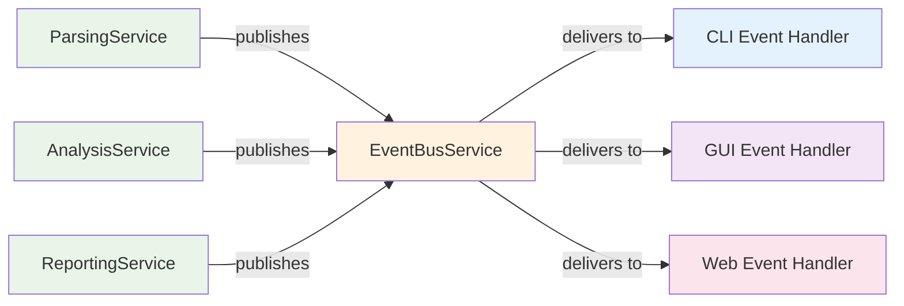

# UI-Service Communication Patterns

This document describes the hybrid event bus and progress callback architecture that enables complete decoupling between the service layer and user interface implementations.

## Overview

KP-Dagger uses a hybrid approach to maintain complete separation between business logic (services) and presentation logic (UI):

1. **Event Bus** - For architectural events and loose coupling
2. **Progress Callbacks** - For fine-grained progress reporting and real-time updates

This design ensures services remain UI-agnostic while providing rich feedback to CLI, GUI, or web interfaces.

## Architecture Components



## Document Structure

This architecture documentation is organized into the following sections:

- **[Event Bus Pattern](event-bus-pattern.md)** - Core event system implementation with strongly typed events and safe publishing
- **[Memory Management](memory-management.md)** - Automatic subscription cleanup and memory leak prevention
- **[Progress Callbacks](progress-callbacks.md)** - Fine-grained progress reporting with separated interfaces
- **[Workflow Orchestration](workflow-orchestration.md)** - UI-aware orchestration patterns that coordinate business logic with user feedback
- **[Testing Patterns](testing-patterns.md)** - Testing approaches for decoupled architectures
- **[Benefits and Design](benefits-and-design.md)** - Design principles and architectural benefits

## Key Design Principles

### True Service Independence
Services function completely independently of UI concerns:
- No mandatory UI dependencies
- Optional event publishing
- Pure business logic focus
- Fail-safe design

### Complete UI Decoupling
UI implementations are interchangeable:
- Services have no knowledge of UI implementations
- Same services work with CLI, GUI, web, or API interfaces
- Easy to add new UI types without changing services

### Memory Safety
Automatic resource management prevents leaks:
- Context managers for subscription cleanup
- Thread-safe operations
- Resource efficiency

### Rich User Experience
Multiple feedback mechanisms:
- Real-time progress updates via callbacks
- Contextual notifications via events
- Cancellation support
- Flexible event handling

## Quick Start

For a basic CLI implementation:

```python
# Subscribe to events with automatic cleanup
with event_bus.subscription_context() as subscriptions:
    subscriptions.subscribe(OperationStarted, handler.handle_operation_started)
    subscriptions.subscribe(FindingDiscovered, handler.handle_finding_discovered)
    
    # Execute business logic - events published automatically
    results = workflow.scan_configurations(config_paths)
# All subscriptions automatically cleaned up
```

For headless operation:

```python
# Pure business logic - no UI dependencies
results = workflow.scan_configurations(config_paths)
```

## Next Steps

Start with the [Event Bus Pattern](event-bus-pattern.md) to understand the core event system, then explore [Progress Callbacks](progress-callbacks.md) for fine-grained user feedback.
